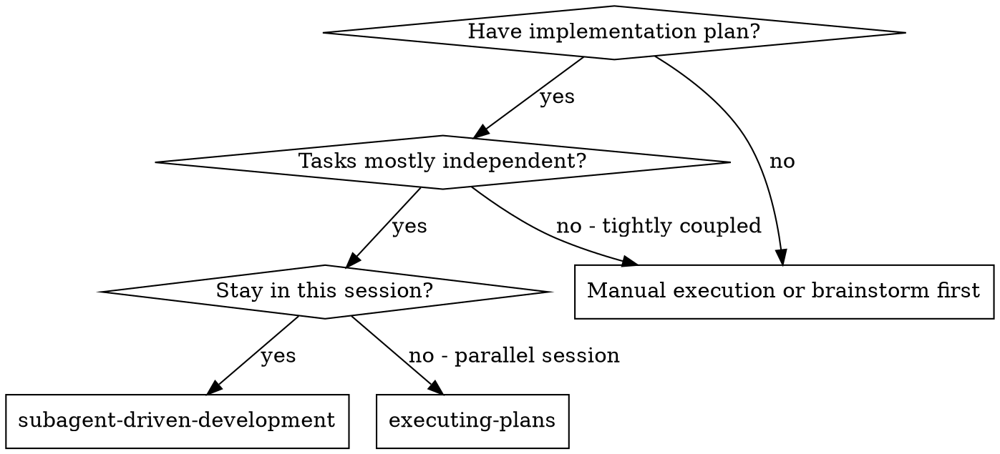
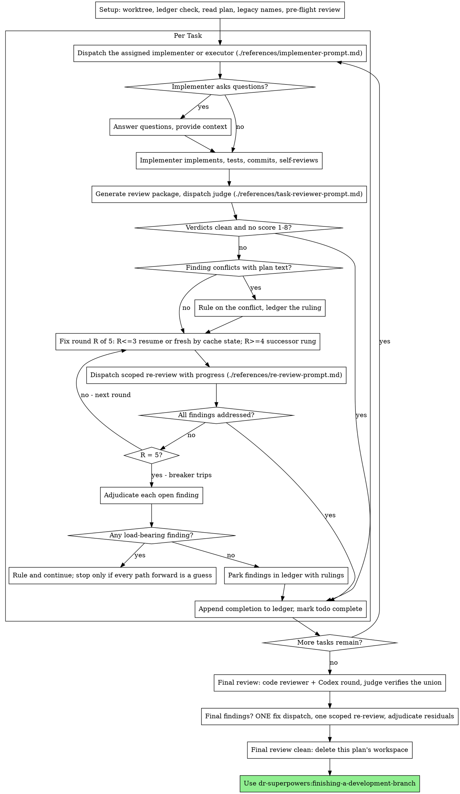

# dr-superpowers Fold Companions Implementation Plan

> **For agentic workers:** REQUIRED SUB-SKILL: Use superpowers:subagent-driven-development (recommended) or superpowers:executing-plans to implement this plan task-by-task. Steps use checkbox (`- [ ]`) syntax for tracking.

> **Implementer assignments:** each task names its implementer agent in an
> `**Implementer:**` line. When executing with
> superpowers:subagent-driven-development, REQUIRED SUB-SKILL:
> dcc-superpower-companions:dispatching-tiered-implementers. Under
> superpowers:executing-plans these lines are inert; ignore them.

> **External executors:** codex

**Goal:** Fold `assigning-implementers` into writing-plans and `dispatching-tiered-implementers` into subagent-driven-development, add the `{#scope}` criterion, the four-score review schema, the Codex checkpoint fields, the legacy-name table and the reference validator, and ship dr-superpowers 1.2.0.

**Architecture:** Data and guards land first (criteria, Codex report contract, validator, legacy table), then the Codex lane and escalation material move verbatim into reference files, then the SDD templates and SKILL.md are rewritten natively on the new ledger grammar, then writing-plans gains the assignment procedure, and only then are the two companion skills deleted — the new reference check catches any dangling name.

**Tech Stack:** Markdown skills; Bash (Git Bash on Windows) + jq for the Codex wrapper and shell tests; Node 22 (`node:test`) for the repository validator.

**Spec:** `docs/superpowers/specs/2026-09-11-dr-superpowers-fold-companions-design.md`

**Execution:** subagent — `claude --model sonnet --effort high` — Tasks 2 (score 5) and 8, 10 (score 4) exceed the Sonnet band, so R5 inline eligibility fails; every task carries its full text for literal execution.

**Program:** docs/superpowers/specs/2026-09-11-dr-superpowers-fork-design.md — sub-project 2 of 5 — next: Session budget

Execute in a worktree (superpowers:using-git-worktrees) branched from `docs/dr-superpowers-fork-design`, which carries the spec and this plan.

## Global Constraints

- Never touch `plugins/darkmem-resume/` (owner's live work) or historical docs under `docs/superpowers/`. Never push. Never merge to main.
- Claude and Codex dr-superpowers manifest versions stay equal: both become `1.2.0`. Catalogs are unchanged.
- Literal prefix rule (enforced by `scripts/validate-repository.mjs`): outside `plugins/dr-superpowers/reference/legacy-names.md`, no file under `plugins/{dr-superpowers,dr-status,dcc-darkraise-ui,dcc-darkraise-win32ui}` may contain `superpowers:` unless preceded by `dr-`, or `dcc-superpower-companions:`. Refer to old prefixes indirectly ("the old plugin name followed by a colon").
- Reference rule (added by Task 4): every `dr-superpowers:<name>` (regex `dr-superpowers:([a-z0-9-]+)`, not followed by `<`) must name `plugins/dr-superpowers/skills/<name>/` or `plugins/dr-superpowers/agents/<name>.md`.
- Files under `plugins/dr-superpowers/criteria/*.md` are ASCII only (use `-`, never an em dash).
- Do not modify `reference/ladder.md`, `reference/external-task-recovery.md`, or any file in `agents/`.
- Commits: `<type>(superpowers): <subject>`, subject ≤50 chars, imperative, English.
- Every test/CLI run bounded with a timeout; kill any process you start.
- All paths are relative to the repository root unless absolute. `P` below means `plugins/dr-superpowers`.

## Contracts

- **Report sections** (Claude implementer report and Codex wrapper report alike): headings `## Discovered issues (not fixed)` and `## Assumptions made`, one `- ` bullet per item, the single word `None` when empty.
- **Codex report schema fields** (`P/scripts/codex-report-schema.json`): `discovered_issues`, `assumptions` — arrays of strings, both required.
- **Criteria ids** (`P/criteria/task-review.md`): `spec`, `scope`, `verification`, `quality`. Scores block, in this order: `### Verification Scores` / `- spec: <1-20>` / `- scope: <1-20>` / `- verification: <1-20>` / `- quality: <1-20>`.
- **Review schema** (`P/criteria/codex-review-schema.json`): integer score properties named exactly the criteria ids; plus `spec_verdict`, `task_quality`, `findings`, `cannot_verify`.
- **Validator error string**: `<path>:<line>: unresolved dr-superpowers reference <name>`.
- **New files**: `P/reference/external-executor.md`, `P/reference/legacy-names.md`, `P/skills/subagent-driven-development/references/escalation.md`, `P/skills/writing-plans/references/assigning-implementers.md`, `P/criteria/codex-review-schema.json`.
- **Translation ruling form**: `Ruling: translated <old> -> <new> — legacy plugin name — none`.

## Assumptions (evidence)

- The Agent tool reports a token figure for a finished subagent: the 2026-09-11 Fable review of this spec returned `subagent_tokens: 190040` after 55 tool uses — consistent with final context size, not cumulative input (inference). R4 uses it, with the time test as fallback.
- Codex strict output's handling of `minimum`/`maximum` is unverified; per spec §6's fallback, the review schema uses an integer `enum` 1..20 unconditionally, so no check is needed.
- `run-codex-task.sh` parses the verdict leniently (`jq -r '.summary // ""'`, line 360), so stub fixtures without the new fields still run.
- `P/scripts/next-step` keys only on `Task N: complete` lines (line 70), so the new ledger lines do not affect it.
- Every `dr-superpowers:<name>` reference in the plugins resolved on 2026-09-11 (grep in the design session); the only placeholder hit is `dr-superpowers:impl-<model>-<effort>`.
- `codex` 0.153.4 is authenticated and batch-capable (`detect-executors.sh`, 2026-09-11).
- Plan-time ruling: spec §7's "unknown suffix stops and asks" is read together with the owner's rulings-not-stops decision — a suffix outside the legacy table is not a legacy name; subagent-driven-development handles it through its Dispatch rulings, writing-plans asks.

## Task index

1. Criteria: `{#scope}`, four-score review schema, criteria test
2. Codex report schema and contract gain the checkpoint fields
3. Codex wrapper writes the checkpoint sections
4. Validator reference check
5. Legacy-name table and native-codex pointer
6. Move the Codex lane and escalation material
7. SDD prompt templates
8. SDD SKILL.md rewrite
9. writing-plans: assign an implementer to every task
10. Delete the companion skills; routing, README, 1.2.0
11. Full verification sweep

---

### Task 1: Criteria: `{#scope}`, four-score review schema, criteria test

**Files:**
- Modify: `plugins/dr-superpowers/criteria/task-review.md`
- Create: `plugins/dr-superpowers/criteria/codex-review-schema.json`
- Test: `plugins/dr-superpowers/tests/criteria.test.sh:53-58`

**Interfaces:**
- Consumes: nothing
- Produces: criteria ids `spec scope verification quality`; `criteria/codex-review-schema.json` (used by Tasks 6 and 8)

**Implementer:** dcc-superpower-companions:impl-opus-low
**Executor:** codex gpt-5.6-sol / high
**Evaluation:** files 1 - spec 0 - coupling 2 - risk 1 = 4

- [ ] **Step 1: Update the test first**

In `plugins/dr-superpowers/tests/criteria.test.sh`, replace lines 53-58:

```bash
# task-review.md is named by the dispatching skill, so its ids are a contract.
TR="$CRITERIA/task-review.md"
if [ -f "$TR" ]; then
  got=$(grep -o '{#[a-z0-9_]\{1,\}}' "$TR" | tr -d '{#}' | LC_ALL=C sort | tr '\n' ' ' | sed 's/ $//')
  check "task-review exposes the three contracted ids" "$got" "quality spec verification"
fi
```

with:

```bash
# task-review.md is named by subagent-driven-development, so its ids are a contract.
TR="$CRITERIA/task-review.md"
if [ -f "$TR" ]; then
  got=$(grep -o '{#[a-z0-9_]\{1,\}}' "$TR" | tr -d '{#}' | LC_ALL=C sort | tr '\n' ' ' | sed 's/ $//')
  check "task-review exposes the four contracted ids" "$got" "quality scope spec verification"
fi

# The Codex review seat returns the same criteria through a JSON schema. Its
# integer score fields must be exactly task-review.md's ids, or that seat scores
# a different rubric from the judges it is averaged with.
SCHEMA="$CRITERIA/codex-review-schema.json"
check "codex-review-schema.json exists" "$([ -f "$SCHEMA" ] && echo yes || echo no)" "yes"
if [ -f "$SCHEMA" ] && [ -f "$TR" ]; then
  want=$(grep -o '{#[a-z0-9_]\{1,\}}' "$TR" | tr -d '{#}' | LC_ALL=C sort | tr '\n' ' ' | sed 's/ $//')
  got=$(jq -r '.properties | to_entries[] | select(.value.type=="integer") | .key' "$SCHEMA" \
    | tr -d '\r' | LC_ALL=C sort | tr '\n' ' ' | sed 's/ $//')
  check "codex review schema scores exactly the task-review ids" "$got" "$want"
  # Strict structured output rejects a schema whose required list omits a key.
  check "codex review schema requires every property" \
    "$(jq -r '((.properties|keys)-(.required))|join(",")' "$SCHEMA" | tr -d '\r')" ""
  check "codex review findings items are strict" \
    "$(jq -r '.properties.findings.items | (.additionalProperties == false) and ((((.properties|keys)-(.required))|length) == 0)' "$SCHEMA" | tr -d '\r')" "true"
fi
```

- [ ] **Step 2: Run the test to verify it fails**

Run: `timeout 60 bash plugins/dr-superpowers/tests/criteria.test.sh`
Expected: FAIL lines for "task-review exposes the four contracted ids" and "codex-review-schema.json exists"; exit non-zero.

- [ ] **Step 3: Add `{#scope}` and the reciprocal ignore clauses**

In `plugins/dr-superpowers/criteria/task-review.md`:

Replace lines 3-4:

```
Applied by dr-superpowers:dispatching-tiered-implementers when a task
reviewer scores one task's implementation.
```

with:

```
Applied by dr-superpowers:subagent-driven-development when a task
reviewer scores one task's implementation.
```

Replace the last two lines of the Spec Compliance paragraph:

```
a LOW signal no matter how clean the rest of the batch is. Ignore code quality,
test design, and whether the tests were actually run; other criteria own those.
```

with:

```
a LOW signal no matter how clean the rest of the batch is. Ignore code quality,
test design, and whether the tests were actually run; other criteria own those.
Ignore style drift, comment edits, adjacent refactors, and orphans; Scope
Hygiene owns those.

### Scope Hygiene {#scope}

Look at every hunk in the diff that does not trace to a requirement in the task
brief. Score HIGH when every changed line traces to the brief, and when orphans
this change created - imports, helpers, or variables its own edits made unused -
are removed. Score LOW for reformatting or style drift on lines the task did not
need to touch, comment edits unrelated to the change, adjacent refactors,
deletion of pre-existing dead code nobody asked for, or orphans this change left
behind. Ignore missing requirements and unrequested features, which Spec
Compliance owns; ignore test evidence, which Empirical Verification owns; ignore
correctness, which Code Quality owns.
```

Replace the last two lines of the Code Quality paragraph:

```
coverage, which Spec Compliance owns, and ignore pre-existing problems in code
this diff does not touch.
```

with:

```
coverage, which Spec Compliance owns, and ignore pre-existing problems in code
this diff does not touch. Ignore whether a hunk was requested; Spec Compliance
and Scope Hygiene own that.
```

- [ ] **Step 4: Create the review schema**

Create `plugins/dr-superpowers/criteria/codex-review-schema.json`:

```json
{
  "type": "object",
  "additionalProperties": false,
  "required": ["spec", "scope", "verification", "quality", "spec_verdict", "task_quality", "findings", "cannot_verify"],
  "properties": {
    "spec": { "type": "integer", "enum": [1, 2, 3, 4, 5, 6, 7, 8, 9, 10, 11, 12, 13, 14, 15, 16, 17, 18, 19, 20], "description": "Spec Compliance score, 1 clear failure to 20 clearly met." },
    "scope": { "type": "integer", "enum": [1, 2, 3, 4, 5, 6, 7, 8, 9, 10, 11, 12, 13, 14, 15, 16, 17, 18, 19, 20], "description": "Scope Hygiene score, 1 clear failure to 20 clearly met." },
    "verification": { "type": "integer", "enum": [1, 2, 3, 4, 5, 6, 7, 8, 9, 10, 11, 12, 13, 14, 15, 16, 17, 18, 19, 20], "description": "Empirical Verification score, 1 clear failure to 20 clearly met." },
    "quality": { "type": "integer", "enum": [1, 2, 3, 4, 5, 6, 7, 8, 9, 10, 11, 12, 13, 14, 15, 16, 17, 18, 19, 20], "description": "Code Quality score, 1 clear failure to 20 clearly met." },
    "spec_verdict": { "type": "string", "enum": ["compliant", "issues"] },
    "task_quality": { "type": "string", "enum": ["approved", "needs_fixes"] },
    "findings": {
      "type": "array",
      "items": {
        "type": "object",
        "additionalProperties": false,
        "required": ["severity", "file", "line", "summary"],
        "properties": {
          "severity": { "type": "string", "enum": ["Critical", "Important", "Minor"] },
          "file": { "type": "string" },
          "line": { "type": "integer", "description": "1-based line; 0 when the finding has no single line." },
          "summary": { "type": "string" }
        }
      }
    },
    "cannot_verify": {
      "type": "array",
      "items": { "type": "string" },
      "description": "Requirements that cannot be verified from the diff alone; empty when none."
    }
  }
}
```

- [ ] **Step 5: Run the test to verify it passes**

Run: `timeout 60 bash plugins/dr-superpowers/tests/criteria.test.sh`
Expected: `0 failed`; exit 0.

- [ ] **Step 6: Commit**

```bash
git add plugins/dr-superpowers/criteria plugins/dr-superpowers/tests/criteria.test.sh
git commit -m "feat(superpowers): add scope criterion and schema"
```

---

### Task 2: Codex report schema and contract gain the checkpoint fields

**Files:**
- Modify: `plugins/dr-superpowers/scripts/codex-report-schema.json`
- Modify: `plugins/dr-superpowers/scripts/codex-task-contract.md`
- Test: `plugins/dr-superpowers/tests/run-codex-task.test.sh` (after line 59)

**Interfaces:**
- Consumes: nothing
- Produces: schema fields `discovered_issues`, `assumptions` (arrays of strings), consumed by Task 3

**Implementer:** dcc-superpower-companions:impl-opus-medium
**Evaluation:** files 1 - spec 0 - coupling 2 - risk 2 = 5

- [ ] **Step 1: Add the failing checks**

In `plugins/dr-superpowers/tests/run-codex-task.test.sh`, insert after line 59 (the `schema declares a required array` check):

```bash
# The ledger's per-task checkpoint reads these two arrays, so an executor-lane
# task reports discovered issues and assumptions exactly as a Claude one does.
check "schema carries the two checkpoint arrays" \
  "$(jq -r '[.properties.discovered_issues.type, .properties.assumptions.type] | join(",")' \
      < "$HERE/../scripts/codex-report-schema.json" | tr -d '\r')" "array,array"
check "contract names both checkpoint fields" \
  "$(grep -c -e '`discovered_issues`' -e '`assumptions`' "$HERE/../scripts/codex-task-contract.md")" "2"
```

- [ ] **Step 2: Run the test to verify it fails**

Run: `timeout 120 bash plugins/dr-superpowers/tests/run-codex-task.test.sh`
Expected: FAIL on "schema carries the two checkpoint arrays" and "contract names both checkpoint fields".

- [ ] **Step 3: Extend the schema**

Replace the whole of `plugins/dr-superpowers/scripts/codex-report-schema.json` with:

```json
{
  "type": "object",
  "required": ["status", "summary", "commit_subject", "questions", "discovered_issues", "assumptions"],
  "additionalProperties": false,
  "properties": {
    "status": {
      "type": "string",
      "enum": ["DONE", "BLOCKED", "NEEDS_CONTEXT"]
    },
    "summary": {
      "type": "string",
      "description": "What was changed and why, in the voice of an implementer report."
    },
    "commit_subject": {
      "type": "string",
      "description": "Conventional-commit subject line: type(scope): subject, imperative, no trailing period, 50 characters or fewer."
    },
    "questions": {
      "type": "array",
      "items": { "type": "string" },
      "description": "Required when status is NEEDS_CONTEXT; empty otherwise."
    },
    "discovered_issues": {
      "type": "array",
      "items": { "type": "string" },
      "description": "Problems noticed while working that this task did not fix, one sentence each; empty when none."
    },
    "assumptions": {
      "type": "array",
      "items": { "type": "string" },
      "description": "Decisions made where the brief was silent, one sentence each; empty when none."
    }
  }
}
```

- [ ] **Step 4: Extend the contract**

In `plugins/dr-superpowers/scripts/codex-task-contract.md`, replace the last line:

```
- `questions`: required when `status` is `NEEDS_CONTEXT`, empty otherwise.
```

with:

```
- `questions`: required when `status` is `NEEDS_CONTEXT`, empty otherwise.
- `discovered_issues`: problems you noticed while working and did not fix,
  because the brief did not ask for them - one sentence each. Empty when there
  are none. Never fix one just to shorten this list.
- `assumptions`: decisions you made where the brief was silent - one sentence
  each. Empty when there are none.
```

- [ ] **Step 5: Run the tests to verify they pass**

Run: `timeout 120 bash plugins/dr-superpowers/tests/run-codex-task.test.sh`
Expected: `0 failed` (the existing "schema required covers every property" check also passes).

Run: `timeout 300 bash plugins/dr-superpowers/tests/executor-recovery.test.sh`
Expected: `0 failed` (the stub does not emit the new fields yet; the wrapper parses leniently).

- [ ] **Step 6: Commit**

```bash
git add plugins/dr-superpowers/scripts/codex-report-schema.json plugins/dr-superpowers/scripts/codex-task-contract.md plugins/dr-superpowers/tests/run-codex-task.test.sh
git commit -m "feat(superpowers): add codex checkpoint report fields"
```

---

### Task 3: Codex wrapper writes the checkpoint sections

**Files:**
- Modify: `plugins/dr-superpowers/scripts/run-codex-task.sh:355-362,390`
- Test: `plugins/dr-superpowers/tests/executor-recovery.test.sh:36,52`

**Interfaces:**
- Consumes: schema fields `discovered_issues`, `assumptions` from Task 2
- Produces: report sections `## Discovered issues (not fixed)` and `## Assumptions made` (Contracts)

**Implementer:** dcc-superpower-companions:impl-sonnet-high
**Executor:** codex gpt-5.5 / high
**Evaluation:** files 1 - spec 0 - coupling 1 - risk 1 = 3

- [ ] **Step 1: Update the stub fixture and add the failing checks**

In `plugins/dr-superpowers/tests/executor-recovery.test.sh`, replace line 36:

```bash
printf '{"status":"%s","summary":"fixture","commit_subject":"feat(test): produce file","questions":[]}\n' "${STUB_STATUS:-DONE}" > "$out"
```

with:

```bash
printf '{"status":"%s","summary":"fixture","commit_subject":"feat(test): produce file","questions":[],"discovered_issues":["fixture issue"],"assumptions":[]}\n' "${STUB_STATUS:-DONE}" > "$out"
```

Insert after line 52 (`check 'success commits produced file' ...`):

```bash
check 'report lists discovered issues' \
  "$(grep -A2 '^## Discovered issues (not fixed)$' "$fixture/report.md" | tail -1 | tr -d '\r')" '- fixture issue'
check 'report says None for empty assumptions' \
  "$(grep -A2 '^## Assumptions made$' "$fixture/report.md" | tail -1 | tr -d '\r')" 'None'
```

- [ ] **Step 2: Run the test to verify it fails**

Run: `timeout 300 bash plugins/dr-superpowers/tests/executor-recovery.test.sh`
Expected: FAIL on the two new checks only.

- [ ] **Step 3: Parse and write the sections**

In `plugins/dr-superpowers/scripts/run-codex-task.sh`, replace lines 355-362:

```bash
status=BLOCKED
summary=""
subject=""
if [ -f "$last" ]; then
  status=$(jq -r '.status // "BLOCKED"' "$last" 2>/dev/null || echo BLOCKED)
  summary=$(jq -r '.summary // ""' "$last" 2>/dev/null || true)
  subject=$(jq -r '.commit_subject // ""' "$last" 2>/dev/null || true)
fi
```

with:

```bash
status=BLOCKED
summary=""
subject=""
discovered=""
assumptions=""
if [ -f "$last" ]; then
  status=$(jq -r '.status // "BLOCKED"' "$last" 2>/dev/null || echo BLOCKED)
  summary=$(jq -r '.summary // ""' "$last" 2>/dev/null || true)
  subject=$(jq -r '.commit_subject // ""' "$last" 2>/dev/null || true)
  discovered=$(jq -r '(.discovered_issues // [])[] | "- " + .' "$last" 2>/dev/null || true)
  assumptions=$(jq -r '(.assumptions // [])[] | "- " + .' "$last" 2>/dev/null || true)
fi
```

Then replace the line (formerly 390):

```bash
  printf '\n## Summary\n\n%s\n' "$summary"
```

with:

```bash
  printf '\n## Summary\n\n%s\n' "$summary"
  printf '\n## Discovered issues (not fixed)\n\n%s\n' "${discovered:-None}"
  printf '\n## Assumptions made\n\n%s\n' "${assumptions:-None}"
```

- [ ] **Step 4: Run the tests to verify they pass**

Run: `timeout 300 bash plugins/dr-superpowers/tests/executor-recovery.test.sh`
Expected: `0 failed`.

Run: `timeout 120 bash plugins/dr-superpowers/tests/run-codex-task.test.sh`
Expected: `0 failed`.

- [ ] **Step 5: Commit**

```bash
git add plugins/dr-superpowers/scripts/run-codex-task.sh plugins/dr-superpowers/tests/executor-recovery.test.sh
git commit -m "feat(superpowers): report codex checkpoint sections"
```

---

### Task 4: Validator reference check

**Files:**
- Modify: `scripts/validate-repository.mjs:96-98`
- Test: `tests/repository-layout.test.mjs:38` and a new test at the end

**Interfaces:**
- Consumes: nothing
- Produces: error string `<path>:<line>: unresolved dr-superpowers reference <name>` (Contracts); Task 10 relies on it to catch dangling names

**Implementer:** dcc-superpower-companions:impl-sonnet-medium
**Executor:** codex gpt-5.5 / medium
**Evaluation:** files 1 - spec 0 - coupling 0 - risk 1 = 2

- [ ] **Step 1: Add the failing tests**

In `tests/repository-layout.test.mjs`, insert after line 38 (the `legacy name reference` case, inside the same array):

```js
    ['unresolved dr-superpowers reference', (c, dir) => { writeFileSync(resolve(dir, 'plugins/dr-superpowers/reference/stray.md'), 'see dr-superpowers:no-such-skill\n'); }, /unresolved dr-superpowers reference no-such-skill/],
```

Append at the end of the file:

```js

test('reference check skips template placeholders and resolves agents', async () => {
  const { validateRepository } = await import('../scripts/validate-repository.mjs');
  const dir = mkdtempSync(resolve(tmpdir(), 'dr-catalog-'));
  try {
    for (const path of ['.claude-plugin', '.agents/plugins', ...json('.claude-plugin/marketplace.json').plugins.map(p => p.source)]) {
      cpSync(resolve(root, path), resolve(dir, path), { recursive: true });
    }
    writeFileSync(resolve(dir, 'plugins/dr-superpowers/reference/placeholder.md'),
      'subagent_type: dr-superpowers:impl-<model>-<effort>\nagent dr-superpowers:judge-fable\nskill dr-superpowers:writing-plans\n');
    assert.deepEqual(validateRepository(dir), []);
  } finally { rmSync(dir, { recursive: true, force: true }); }
});
```

- [ ] **Step 2: Run the tests to verify they fail**

Run: `timeout 180 node --test tests/repository-layout.test.mjs`
Expected: FAIL on `unresolved dr-superpowers reference` (no such error is produced yet); the placeholder test passes.

- [ ] **Step 3: Implement the check**

In `scripts/validate-repository.mjs`, replace lines 96-98:

```js
        readFileSync(path, 'utf8').split('\n').forEach((line, index) => {
          if (legacyPattern.test(line)) errors.push(`${rel}:${index + 1}: legacy plugin-name reference`);
        });
```

with:

```js
        readFileSync(path, 'utf8').split('\n').forEach((line, index) => {
          if (legacyPattern.test(line)) errors.push(`${rel}:${index + 1}: legacy plugin-name reference`);
          for (const match of line.matchAll(/dr-superpowers:([a-z0-9-]+)/g)) {
            // A name followed by `<` is a template placeholder such as impl-<model>-<effort>.
            if (line[match.index + match[0].length] === '<') continue;
            const name = match[1];
            if (!existsSync(resolve(root, 'plugins/dr-superpowers/skills', name)) &&
                !existsSync(resolve(root, 'plugins/dr-superpowers/agents', `${name}.md`))) {
              errors.push(`${rel}:${index + 1}: unresolved dr-superpowers reference ${name}`);
            }
          }
        });
```

`legacy-names.md` stays exempt from both checks through the existing `legacyAllowed` skip above this loop.

- [ ] **Step 4: Run the tests to verify they pass**

Run: `timeout 180 node --test tests/repository-layout.test.mjs`
Expected: all tests pass.

Run: `timeout 60 node scripts/validate-repository.mjs`
Expected: `Repository catalogs, manifests, versions, and bundled links are valid.` If it reports an unresolved reference in an existing file, stop and report it (DONE_WITH_CONCERNS) — do not widen the regex.

- [ ] **Step 5: Commit**

```bash
git add scripts/validate-repository.mjs tests/repository-layout.test.mjs
git commit -m "feat(superpowers): validate dr-superpowers references"
```

---

### Task 5: Legacy-name table and native-codex pointer

**Files:**
- Create: `plugins/dr-superpowers/reference/legacy-names.md`
- Modify: `plugins/dr-superpowers/reference/native-codex.md:184-188`

**Interfaces:**
- Consumes: nothing
- Produces: `reference/legacy-names.md` (linked by Tasks 8 and 9); the translation ruling form (Contracts)

**Implementer:** dcc-superpower-companions:impl-sonnet-high
**Executor:** codex gpt-5.5 / high
**Evaluation:** files 1 - spec 0 - coupling 2 - risk 0 = 3

- [ ] **Step 1: Create the table**

Create `plugins/dr-superpowers/reference/legacy-names.md` with exactly:

````markdown
# Legacy plugin names

Plans, ledgers, and notes written before dr-superpowers 1.2.0 name skills and
agents under older plugin prefixes. Resolve them with this table when you read
them.

This is the only file in the maintained plugins allowed to spell the old
prefixes literally; `scripts/validate-repository.mjs` enforces that.

## Rule

- Resolve by suffix, whatever old prefix precedes it: `superpowers:`,
  `dcc-superpower-companions:`, or `dr-superpowers:`.
- Translate at read time. Never rewrite the plan or note that carries the name.
- Log one ledger line per distinct name translated:
  `Ruling: translated <old> -> <new> — legacy plugin name — none`
- A suffix not in the tables below is not a legacy name. It is an unknown name:
  dr-superpowers:subagent-driven-development handles it through its Dispatch
  rulings; any other reader stops and asks.

## Skills

| Suffix | Resolves to |
|---|---|
| `using-superpowers` | `dr-superpowers:using-superpowers` |
| `brainstorming` | `dr-superpowers:brainstorming` |
| `selecting-approaches` | `dr-superpowers:selecting-approaches` |
| `writing-plans` | `dr-superpowers:writing-plans` |
| `executing-plans` | `dr-superpowers:executing-plans` |
| `subagent-driven-development` | `dr-superpowers:subagent-driven-development` |
| `test-driven-development` | `dr-superpowers:test-driven-development` |
| `systematic-debugging` | `dr-superpowers:systematic-debugging` |
| `verification-before-completion` | `dr-superpowers:verification-before-completion` |
| `requesting-code-review` | `dr-superpowers:requesting-code-review` |
| `receiving-code-review` | `dr-superpowers:receiving-code-review` |
| `finishing-a-development-branch` | `dr-superpowers:finishing-a-development-branch` |
| `using-git-worktrees` | `dr-superpowers:using-git-worktrees` |
| `writing-skills` | `dr-superpowers:writing-skills` |
| `dispatching-parallel-agents` | No skill. Dispatch independent agents in one message so they run concurrently |
| `assigning-implementers` | `dr-superpowers:writing-plans`, section "Assign an implementer to every task" |
| `dispatching-tiered-implementers` | `dr-superpowers:subagent-driven-development` |

A plan header that says "REQUIRED SUB-SKILL: <old prefix>dispatching-tiered-implementers"
therefore needs nothing extra: subagent-driven-development already reads the
`**Implementer:**` lines itself.

## Agents

Each suffix resolves to `dr-superpowers:` followed by the same suffix.

| Suffix |
|---|
| `impl-haiku` |
| `impl-sonnet-low` |
| `impl-sonnet-medium` |
| `impl-sonnet-high` |
| `impl-sonnet-xhigh` |
| `impl-sonnet-max` |
| `impl-opus-low` |
| `impl-opus-medium` |
| `impl-opus-high` |
| `impl-opus-xhigh` |
| `impl-opus-max` |
| `impl-fable-low` |
| `impl-fable-medium` |
| `impl-fable-high` |
| `impl-fable-xhigh` |
| `impl-fable-max` |
| `judge-fable` |
| `judge-opus` |
| `scout-sonnet` |

Translation changes only the prefix. The tier a plan recorded — including a
reserve agent a human assigned — is the tier it runs at.
````

- [ ] **Step 2: Point native-codex.md at the table**

In `plugins/dr-superpowers/reference/native-codex.md`, replace lines 184-188:

```
On a Claude host only, translate the exact legacy agent prefix — the old plugin
name `dcc-superpower-companions` followed by `:` — to `dr-superpowers:` when
its suffix names an existing bundled agent file.
Reject unknown suffixes. Preserve effort, Evaluation, and reserve overrides and
record the namespace translation in the ledger without rewriting the plan.
```

with:

```
On a Claude host only, translate legacy skill and agent names per
[legacy-names.md](legacy-names.md). A suffix outside that table is not a legacy
name; it is handled as an unknown name. Preserve effort, Evaluation, and
reserve overrides and record the namespace translation in the ledger without
rewriting the plan.
```

Lines 189-192 (new Claude plans and native-to-Claude conversion) stay as they are.

- [ ] **Step 3: Verify**

Run: `timeout 60 node scripts/validate-repository.mjs`
Expected: `Repository catalogs, manifests, versions, and bundled links are valid.` (the table is exempt from both prefix checks).

Run: `grep -c 'legacy-names.md' plugins/dr-superpowers/reference/native-codex.md`
Expected: `1`

Run: `timeout 60 bash plugins/dr-superpowers/tests/native-routing.test.sh`
Expected: `0 failed` (it parses only the JSON block of native-codex.md).

- [ ] **Step 4: Commit**

```bash
git add plugins/dr-superpowers/reference/legacy-names.md plugins/dr-superpowers/reference/native-codex.md
git commit -m "feat(superpowers): add legacy-name translation table"
```

---

### Task 6: Move the Codex lane and escalation material

**Files:**
- Create: `plugins/dr-superpowers/reference/external-executor.md`
- Create: `plugins/dr-superpowers/skills/subagent-driven-development/references/escalation.md`

**Interfaces:**
- Consumes: `criteria/codex-review-schema.json` (Task 1)
- Produces: the two files, linked by Tasks 8 and 9. Section headings in external-executor.md (`## Planning`, `## Dispatch`, `## When a run fails`, `## Resuming a Codex task`, `## When the resume itself fails`, `## Risk-3 Codex seat`, `## Final-review Codex round`, `## Failure rows`) are link targets.

**Implementer:** dcc-superpower-companions:impl-sonnet-high
**Executor:** codex gpt-5.5 / high
**Evaluation:** files 1 - spec 0 - coupling 2 - risk 0 = 3

This task is a verbatim move from `plugins/dr-superpowers/skills/dispatching-tiered-implementers/SKILL.md` with the spec's allowed edits already applied below. Write the files exactly as given; do not re-derive them from the source. The source skill is deleted later, in Task 10.

- [ ] **Step 1: Create `reference/external-executor.md`**

Create `plugins/dr-superpowers/reference/external-executor.md` with exactly:

````markdown
# External executor lane

This reference holds the Claude-hosted Codex CLI lane.
dr-superpowers:writing-plans reads Planning; dr-superpowers:subagent-driven-development
reads everything else. A native Codex host never uses this lane: it follows
[native-codex.md](native-codex.md), and a Claude `**Executor:**` line never
starts recursive CLI offload in a Codex host.

The lane is a gate in front of the Claude assignment table, never a rung on the
escalation ladder. [ladder.md](ladder.md) explains why, and holds the `gate`,
`codex-assignment`, `codex-successor`, and `codex-timeout` blocks read below.

## Planning

Run this once per plan, after scoring every task and before writing any
assignment line:

```bash
bash "${CLAUDE_PLUGIN_ROOT}/scripts/detect-executors.sh"
```

Render the roster as a multi-select question: one tickable option per executor
whose `usable` is `true`, and a prose line naming every other detected executor
with its `reason`. **If no executor is usable, ask nothing** and write the plan
Claude-only - an empty checkbox is a worse answer than no checkbox.

Record the tick as one appended blockquote line in the plan header:

```markdown
> **External executors:** codex
```

Then apply the lane gate from the `gate` block of [ladder.md](ladder.md) to each
task. All four conditions must hold:

- an executor was ticked,
- the task cleared Rule S without a human override,
- `total >= min_score`,
- `risk <= max_risk`.

A task that passes the gate takes its model and effort from that file's
`codex-assignment` block and gains one extra line. A task that fails it is
assigned from the Claude table exactly as before and gains nothing.

**The `**Implementer:**` line still names the Claude agent for the score.** The
executor is an override on a second line, never a replacement on the first:

```markdown
**Implementer:** dr-superpowers:impl-sonnet-medium
**Executor:** codex gpt-5.5 / medium
**Evaluation:** files 0 - spec 1 - coupling 1 - risk 0 = 2
```

**Batched tasks stay on the Claude lane.** A batch is one dispatch covering
several tasks, which a per-task `**Executor:**` line and per-task thread id
cannot represent. Do not write an `**Executor:**` line on a batched task.

## Dispatch

A task carrying an `**Executor:**` line runs on that CLI instead of its
`**Implementer:**` agent. Everything downstream - the review seat, the fix loop,
the ledger, the five-round cap - is unchanged, because the contract the loop
enforces is files and commits, not a particular runtime.

**There is no driver subagent.** Run the wrapper yourself as a background Bash
call, exactly as you already run `sdd-workspace` and `task-brief`. It prints one
status line and writes everything else to files.

**Background is not a preference here, it is the only shape that works.** The
Bash tool's `timeout` caps at 600000 ms - ten minutes - and every rung in
`codex-timeout` is longer than that, from 900 seconds to 2400. There is no
foreground timeout you can pass that outlasts even the cheapest rung, so a
foreground call is cut mid-run and a controller reading that as a Codex failure
has misdiagnosed its own harness.

A background call is not bound by `timeout` at all - measured, not assumed: a
25-second command under a 5000 ms timeout ran to completion and exited 0. So
pass no timeout, let the wrapper's own poll loop be the bound it already is, and
wait for the completion notification. The wrapper polls for the rung's
`codex-timeout` seconds, kills Codex, and always prints a status line, which is
the guarantee that makes waiting safe.

If you have a reason to run one in the foreground anyway, the ceiling is raised
by the `BASH_MAX_TIMEOUT_MS` environment variable, which your human partner sets
before the session starts. You cannot raise it from inside one.

**Reserve an exclusive linked worktree.** Refuse the primary checkout. Stop other
controller-owned writing agents/watchers there before offload; require manual
editing to cease in that worktree. The user can continue in the primary
checkout. Fingerprints detect drift, not who wrote it. Never remove a blocked or
unreconciled worktree. Read [external-task-recovery.md](external-task-recovery.md)
for ownership, artifacts, approved write sets, and recovery operations.

1. **Guard the roster.** Run
   `bash "${CLAUDE_PLUGIN_ROOT}/scripts/detect-executors.sh"` and read the entry
   for the named executor. **Never trust the plan's copy** - it records what was
   available when the plan was written.

   If `usable` is false, dispatch the task's `**Implementer:**` agent on the
   Claude lane instead, say the substitution aloud, and record it, quoting the
   entry's `reason` field:

   ```
   Task <N>: implementer impl-sonnet-medium (assigned; base <sha7>; executor codex unavailable - <reason>)
   ```

   Never fall back silently. A silent fallback makes the whole lane invisible.

2. **Run the wrapper**, using the brief path `task-brief` printed and the
   worktree's repository root:

   ```bash
   bash "${CLAUDE_PLUGIN_ROOT}/scripts/run-codex-task.sh" \
     --brief <brief> --report <workspace>/task-<N>-report.md \
     --cwd <worktree-root> --task-id <stable-task-id> --write-set <approved-paths.json> --model <model> --effort <effort>
   ```

   `--cwd` is the linked worktree root. Use the same task ID for initial runs,
   retries, and fix resumes, independently of the report filename. Derive the
   JSON write set from the plan's explicit create/modify/delete paths. The wrapper
   requires a clean initial index and worktree, stores authoritative artifacts
   under that worktree's Git directory, and stages only its verified scoped diff.
   Human-readable reports belong outside the checkout or in its ignored
   `.superpowers` workspace. An unignored report path is rejected.
   The `**Executor:**` line writes the rung as `codex <model> / <effort>`; the
   wrapper takes the two as separate flags. The timeout comes from
   [ladder.md](ladder.md)'s `codex-timeout` block, keyed by `<model>/<effort>`;
   do not pass `--timeout` unless you are deliberately overriding it.

   Record BASE before the run. The wrapper's status line reports the same range
   as `commits=<a7>..<b7>` once the run finishes.

3. **Record the assignment** when the wrapper's status line arrives, reading the
   thread id from its `thread=` field:

   ```
   Task <N>: implementer impl-sonnet-medium (assigned; base <sha7>; executor codex gpt-5.5/medium, thread 01a0...)
   ```

   The thread id must reach the ledger. It also lands in the report file. If it
   lived only in your context, a compaction would turn round 2 into a fresh
   dispatch wearing a resume's name.

4. **Review as normal.** Dispatch the judge exactly as for a Claude task. Do not
   tell it which lane produced the diff: a judge that knows the author scores
   the author, and nothing in its inputs needs to change to keep it unaware.

The wrapper's report carries `## Discovered issues (not fixed)` and
`## Assumptions made` exactly as a Claude implementer's report does, so the
task's complete line takes its checkpoint fields from it the same way.

## When a run fails

A failed *run* is not a failed *review*, and they take different paths. The
wrapper's exit code says which case you are in:

| Exit | Meaning |
|------|---------|
| 0 | `status=DONE`. Proceed to review, unless the report carries the empty-diff note below |
| 1 | Codex ran and did not reach DONE. Read the `status=` field on the same line |
| 2 | No status line was printed. Read the wrapper's own stderr before doing anything - see below |

**This section covers an initial run.** A resume round that fails takes a
different path, because two of the responses below are unavailable to it - see
When the resume itself fails.

A run failure is exit 1 with `status=BLOCKED`, or exit 0 with an empty diff.

An empty diff is the report's `- note: DONE with an empty diff; nothing was
committed` line, not `base==head` alone. Identical shas with no such note mean
the wrapper skipped the commit because `commit_subject` came back empty. Check
the working tree before acting: if it is dirty, Codex did real work that was
never staged - stage it, commit it under a conventional subject, and review as
normal. If it is clean, nothing was produced and this is the empty-diff
capability failure below; take the successor rung.

| Failure | Response |
|---------|----------|
| Transient - network, rate limit, quota, 5xx, named in the report's `## Codex error` section | Retry once at the same rung |
| Timeout - `note=timed-out` on the status line, `exit=124` | Retry once at the same rung with `--timeout` raised. Do not take the successor rung: it is a slower model and would time out too |
| Capability - empty diff, or `status=BLOCKED` with no transient cause | Move one rung via the `codex-successor` block and run once |
| `status=NEEDS_CONTEXT` | Answer the questions the report lists, then resume (below). Not a failure and not a retry, even though it also exits 1 |
| Any failure a second time | `HANDBACK` |

**Read `## Codex error` in the report, not `<report>.stderr`.** Codex reports API
failures - quota, rate limit, auth, 5xx - as events on its `--json` stream, which
is stdout, so they land in `<report>.jsonl` and never in `<report>.stderr`. The
wrapper lifts the first such event into that section for you. stderr holds the
CLI's own complaints instead - a rejected flag, a missing directory - which are
the failures that produce no error event at all, and the report still tails it
underneath.

`status` alone cannot tell you which failure you have, because it is forced to
`BLOCKED` on any non-zero exit. Two other fields separate the cases:

- **`exit=`** on the status line, and `- exit:` in the report, is Codex's own
  exit code. `exit=2` is an argument-parse failure that took milliseconds and no
  model call, and it means this wrapper and this CLI disagree - fix that rather
  than retrying or changing rung. `exit=1` with a `## Codex error` section is an
  ordinary failed run. `exit=0` with `status=BLOCKED` is the odd one: Codex
  finished cleanly and wrote no verdict, which is a capability failure.
- **`note=timed-out`**, with `exit=124`, means the wrapper's poll loop hit the
  rung's `codex-timeout` and killed Codex. You do not have to infer this from
  wall time - which you could not do anyway, since the wrapper runs as a
  background call and you are not watching the clock.

`note=codex-may-still-be-running` means the child outlived both kills and the
grace window - only a timeout reaches that path, so it appears alongside
`note=timed-out`. Check for and end that process before retrying, or the retry
puts two Codex runs in the same worktree.

A second `NEEDS_CONTEXT` on the same task is a capability failure: take the
successor rung or hand back. A one-shot agent that could not resolve the brief
after one clarification will not resolve it after two.

At most two Codex runs may *fail* per task before Claude takes over. Fix-round
resumes are not failures and do not count against that budget. `HANDBACK` is an
action, not a rung: dispatch the task's `**Implementer:**` agent on the Claude
lane and let the ordinary ladder govern from there. Record it inside the line the
loop is already writing, never as a line of its own.

**Exit 2 requires inspecting durable state before retry.** It can mean preflight,
state persistence, staging, or commit failure. Read the task record's phase and
error; never infer that Codex did not run from the exit code alone. Follow
[external-task-recovery.md](external-task-recovery.md). A failed commit can be
recovered without a model call. Never recover through whole-tree staging or
infer ownership from an old report. Scope changes and manual repairs need a
recorded approved amendment or baseline before automatic work continues.

## Resuming a Codex task

Fix rounds 1 to 3 resume the same Codex session, as a Claude implementer's
rounds do, to preserve its model, effort, and context. The resume-or-re-dispatch
cache rule (R4) does not apply here: the session runs on a separate
subscription, so there is no Claude cache cost to protect. Write the open
findings verbatim into a file and pass that file as the brief - the wrapper
appends the task contract to every run, resume included:

```bash
bash "${CLAUDE_PLUGIN_ROOT}/scripts/run-codex-task.sh" \
  --brief <feedback-file> --report <workspace>/task-<N>-report-r<K>.md \
  --cwd <worktree-root> --task-id <stable-task-id> --write-set <approved-paths.json> --model <model> --effort <effort> --resume <thread-id> --review-round <K>
```

Give each round its own report path. The wrapper replaces the human report that
`--report` names, so reusing one path erases the earlier round that the loop
expects the fix reports to accumulate in. Hand the re-reviewer the round's own
report.

Keep every round's report inside the workspace directory `sdd-workspace` prints -
that directory is git-ignored. If that workspace is not ignored, write reports
outside the checkout, because the wrapper only un-stages the artefacts of the
report path it was given.

**Round 4 is `HANDBACK`.** The Claude implementer inherits the working tree, the
commits, and the report, which is the loop's own "supply the context and
re-dispatch" case. If the progress reading says the loop has stalled at round 3,
the handback happens at round 3 instead: that rule pulls this lane's exit point
earlier exactly as it pulls the Claude ladder's, and it may never push it later.

Handing back lands the task on the Claude assignment-table row for its score -
the tier the rubric picked before the fix rounds happened. The change of model
family plus a fresh context is the capability change rounds 4 and 5 exist to
buy. Say the handback aloud when it happens.

## When the resume itself fails

When a fix round *runs* and produces a bad diff, the fix loop handles it: that is
what the rounds are for. This section is about the other case - the round never
produced a diff to review, because the resume run failed the way an initial run
can fail. When a run fails is written for initial runs and does not apply here
unchanged, because two of its responses are unavailable to a fix round.

**The successor column is never consulted.** `codex-successor` is read only by a
failed initial run - [ladder.md](ladder.md) says so, and the reason is that
changing rung mid-fix-loop discards the session context those rounds exist to
preserve. A fix round that cannot proceed leaves the lane by `HANDBACK` instead,
which is where round 4 was taking it anyway.

**The two-failure budget is not consulted either.** That budget counts failed
*initial* runs, and fix-round resumes do not count against it. These rounds are
bounded by their own rule below and by the five-round cap.

| Resume outcome | Response |
|----------------|----------|
| Transient - the report's `## Codex error` names a rate limit, quota, network, or 5xx | Retry the same resume once, same rung, same thread |
| `note=timed-out` with `exit=124` | Retry the same resume once with `--timeout` raised |
| `exit=2` | The wrapper refused before launching, so nothing ran and the thread is untouched. A validation error in what you passed; fix it and re-issue the same resume. This does not count as a failed round |
| `status=BLOCKED`, or `exit=0` with no verdict, and no transient cause | `HANDBACK` now, rather than at round 4 |
| A second failure of any kind in the same round | `HANDBACK` |

**An empty diff means something different here.** When a run fails calls
`exit 0` with an empty diff a capability failure, that is a statement about an
initial run, where producing nothing means the agent could not start. A fix round
that returns `DONE` with an empty diff has read the findings and elected to
change nothing, which is a position, not a failure. Read the report's summary:
if it argues the findings are already addressed or wrong, adjudicate that claim
yourself the way subagent-driven-development has you adjudicate any disputed
finding, and record the ruling. Do not re-dispatch the round to force a diff. Two
consecutive empty-diff rounds are a stalled loop - `HANDBACK`.

Record any of this inside the fix-round line the loop is already writing, never
as a line of its own:

```
Task <N>: fix round 2/5 (0 addressed, 2 open - codex quota exhausted, retried once then handed back; commits a7f..a7f; HANDBACK to impl-sonnet-medium)
```

A handback from a failed resume is still a handback: say it aloud, and let the
ordinary Claude ladder govern from there.

## Risk-3 Codex seat

On a risk-3 task, one of the three independent review seats is Codex when it is
usable. Risk-3 tasks are excluded from the executor lane by `max_risk 1` in the
`gate` block of [ladder.md](ladder.md), so this seat never reviews Codex's own
work - a property the final-review Codex round does not share. Establish
usability by running `bash "${CLAUDE_PLUGIN_ROOT}/scripts/detect-executors.sh"`
and reading the `usable` field for `codex`; never trust the plan's copy.

Run it as a background Bash call, for the reason Dispatch gives: the Bash tool's
`timeout` caps at ten minutes, this rung's `codex-timeout` row is 1800 seconds,
and a background call is not bound by `timeout` at all.

**This seat needs its own bound, unlike the task wrapper.** It calls `codex`
directly, so there is no wrapper poll loop to kill a run that never returns.
Wrap it in coreutils `timeout` at the rung's value. The task wrapper avoids
`timeout` deliberately - a process between it and node breaks `taskkill`'s tree
walk - but that reasoning is about killing a *writing* Codex cleanly before a
commit. This seat is `-s read-only` and commits nothing, so a blunt kill costs
nothing but the round.

```bash
timeout 1800 codex exec -s read-only -m gpt-5.6-sol -c model_reasoning_effort=high \
  --output-schema "${CLAUDE_PLUGIN_ROOT}/criteria/codex-review-schema.json" \
  -o <workspace>/task-<N>-review-codex.json \
  -C <worktree-root> < <prompt-file>
```

A `timeout` exit of 124 is a seat that produced no score. Fall back to a third
Claude judge rather than averaging two scores as if three had voted.

Use `codex exec`, not `codex exec review`: the latter imposes its own report
shape, and this seat must return the criteria the other two judges return. The
prompt is the task-reviewer prompt with its criteria block, with one change.
**For this seat the criteria block's output-format paragraph is replaced by the
schema, not appended to it.** The shipped schema,
`criteria/codex-review-schema.json`, carries the four criterion names, the 1 to
20 range, and the spec and quality verdicts, and the final message is JSON rather
than a markdown `### Verification Scores` section. Send the criteria themselves -
where to look, what scores high, what to ignore - and let the schema state the
shape. Sent unedited, the prompt would order markdown while `--output-schema`
forbids it.

The schema is a plugin file, outside every worktree, so it can never land in a
task's commit.

If Codex is not usable, dispatch the third judge seat instead - `judge-fable`,
or `judge-opus` when Fable is unavailable or declined - and say so. A Codex seat
changes who scores, not how the scores are read.

## Final-review Codex round

The final whole-branch review adds this round when Codex is usable. Run it as a
background Bash call:

```bash
(cd <worktree-root> && timeout 1800 codex exec review --base <base-branch> \
  -m gpt-5.6-sol -c model_reasoning_effort=high \
  -o <workspace>/final-review-codex.md)
```

`codex exec review` is purpose-built for this and takes no sandbox flag,
because review is read-only by nature. It takes no `-C` either, so the working
directory is the only way to point it at the worktree - hence the subshell.
Bound it with coreutils `timeout`, not the Bash tool's: this is a direct `codex`
call with no wrapper poll loop behind it, and the tool's own `timeout` caps at
ten minutes while a whole-branch round needs more. 1800 seconds matches the
`gpt-5.6-sol/high` row in `codex-timeout`, which is the closest thing to a figure
for a round that block has no row for, and a whole branch is more to read than
one task. Establish usability with the same `detect-executors.sh` check the
risk-3 seat uses; if Codex is not usable, or if `timeout` returns 124, skip this
round, say so, and report the Claude review alone.

Unlike the risk-3 seat, this round is **not** self-review-free. The branch
contains whatever the executor lane produced, so Codex is reviewing some of its
own commits. That is why every finding - whichever reviewer raised it - is then
verified by a judge that wrote none of the code.

## Failure rows

| Situation | Response |
|-----------|----------|
| Task has an `**Executor:**` line and the CLI is usable | Run the wrapper; do not dispatch a subagent for it |
| Task has an `**Executor:**` line and the CLI is missing, unauthenticated, or not batch-capable | Dispatch the `**Implementer:**` agent, say the substitution aloud, record the roster's `reason` in the assigned line |
| The `**Executor:**` line names a model outside `codex-assignment`, an effort outside `low`/`medium`/`high`/`xhigh`/`ultra`, or a pair with no `codex-timeout` row | Ruling: dispatch the `**Implementer:**` agent (`HANDBACK`), say it aloud. The wrapper refuses all three with exit 2 anyway |
| Wrapper exits 2 during staging or commit | Read the durable record; use commit recovery after exact snapshot validation, or explicit reconciliation. Never rerun the model merely to retry a commit |
| Wrapper exits 2 on an initial run with any other message | It refused before launching Codex: a validation error, not a run failure. Ruling: `HANDBACK` to the `**Implementer:**` agent; never retry it unchanged |
| Two Codex runs have failed | `HANDBACK` to the `**Implementer:**` agent and continue on the Claude ladder |
| A fix-round resume failed to run at all | See When the resume itself fails. Never take the successor rung: `codex-successor` is read only by a failed initial run |
| A fix round returned DONE with an empty diff | Codex read the findings and changed nothing on purpose. Adjudicate the report's argument rather than re-dispatching; two in a row is a stalled loop and a `HANDBACK` |

Every ruling above is logged as `Ruling: <what> — <why> — <cost if wrong>` and
said aloud. None of them stops the run.
````

- [ ] **Step 2: Create `references/escalation.md`**

Create `plugins/dr-superpowers/skills/subagent-driven-development/references/escalation.md` with exactly:

````markdown
# Escalation details

Read this when a task reaches an escalation point. The tables themselves - the
assignment, escalation, and reserve tables - live in
[ladder.md](../../../reference/ladder.md); never work from memory.

## Where escalation applies

Three points, and no others:

- **Fix rounds 4 and 5.** Dispatch a fresh implementer on the successor rung.
- **The BLOCKED handler**, when the task requires more reasoning. A BLOCKED
  report caused by missing context is not an escalation: supply the context and
  re-dispatch the same agent.
- **Round 3, when progress has stalled** - the re-review's progress reading is
  less than or equal to the previous round's. This can only pull the escalation
  point earlier, never later.

Escalation does **not** apply to fix rounds 1 and 2, nor to round 3 unless
progress has stalled. Those rounds resume the original agent (subject to the
cache rule), which preserves its model, its effort, and its context.
Re-dispatching a different tier there discards exactly what those rounds exist
to preserve.

None of the three applies to a task running on an external executor. Its fix
rounds resume the same Codex session and it leaves the lane by `HANDBACK`
instead of by climbing a rung - see
[external-executor.md](../../../reference/external-executor.md).

## Recording an escalation

Append one clause to the fix-round line the round already writes:

```
Task <N>: fix round 4/5 (1 addressed, 1 open - <one-liner>; commits <a7>..<b7>; escalated <old-agent> -> <new-agent>)
```

A BLOCKED-handler escalation happens outside the fix loop, so it has no
fix-round line to extend. Record it as a new assigned line for the task:

```
Task <N>: implementer <new-agent> (assigned; base <sha7>; escalated from <old-agent>: BLOCKED)
```

The ladder is deterministic, so the round number and the original assignment
re-derive every escalated agent after a crash.

## The top rung is SPLIT

The ladder's top rung is `impl-opus-high`, whose successor is `SPLIT` - an
action, not an agent. When it is exhausted, do not report BLOCKED yet: break the
task's remaining work into smaller tasks, score each against Rule S, and
dispatch them fresh. Record it as a ruling in the ledger:

```
Ruling: split Task <N> at the top rung into <N>a and <N>b - impl-opus-high exhausted after 5 rounds - if wrong, the halves review separately and merge back
```

**A task may be split-escalated once.** If a split half also exhausts
`impl-opus-high`, the task has resisted both capability and decomposition, and
only then does it enter the reserve chain in
[ladder.md](../../../reference/ladder.md). It enters at `impl-opus-xhigh` and
walks one successor per further exhaustion. Record the entry as its own ruling,
and say it aloud:

```
Ruling: Task <N>a enters the reserve at impl-opus-xhigh - impl-opus-high exhausted again after the split - if wrong, the task is BLOCKED instead and waits for a human
```

A reserve dispatch is the one place this loop spends above the tier the plan
recorded. It should never be a surprise, which is why it is said aloud as well
as written down.

`impl-fable-max` has no successor. When it exhausts, write
`Task <N>: BLOCKED — impl-fable-max exhausted — <what a human must decide>`. Do
not loop, and do not split a second time.

## Reserve agents named in a plan

Nine implementers - the `xhigh` and `max` efforts, and every Fable tier - sit in
the reserve table and in no other table. `impl-opus-high` also appears there,
but only as the conditional entry edge; it is the score-6 execution assignment.

A plan line naming one of the nine is a human ruling, because no score reaches
them, and a human ruling beats the rubric. Dispatch it as written, note the tier
in the assigned line (`reserve tier`), and do not re-score the task down to an
execution tier.

## When a model is unavailable

Each substitution below is a ruling: say it aloud and log
`Ruling: <what> — <why> — <cost if wrong>`. Never substitute silently. If a bad
agent name quietly degraded to the session default, every task would run at the
session's model and effort and nothing in the output would reveal it.

- **An implementer's model is unavailable on this account.** Dispatch the same
  effort one model down: an `impl-opus-<effort>` agent becomes
  `impl-sonnet-<effort>`.
- **No same-effort model below exists** - any Sonnet agent, or `impl-haiku`.
  Haiku ships in one flavour with no effort variants, so "same effort, one model
  down" has no target. Dispatch the agent's successor in the escalation table
  instead. The cost if wrong is spend, not quality.
- **Inside the reserve, for a hand-assigned Fable tier.** The same substitution
  has a target at every effort: `impl-fable-max` drops to `impl-opus-max`,
  `impl-fable-xhigh` to `impl-opus-xhigh`, and `impl-fable-high` to
  `impl-opus-high`.
- **Fable unavailable inside a reserve chain entered automatically.** The task
  reached Fable precisely by exhausting those Opus rungs; re-dispatching one of
  them would re-run an agent that already failed. Write `Task <N>: BLOCKED`
  with the reason instead.

Fable unavailability for a judge seat is a different case: dispatch
`judge-opus` and say so.
````

- [ ] **Step 3: Verify**

Run: `timeout 60 node scripts/validate-repository.mjs`
Expected: `Repository catalogs, manifests, versions, and bundled links are valid.` — the bundled-link check resolves escalation.md's `../../../reference/*.md` links.

Run: `grep -c '^## ' plugins/dr-superpowers/reference/external-executor.md`
Expected: `8`

Run: `grep -nE '(^|[^-])superpowers:|dcc-superpower-companions:' plugins/dr-superpowers/reference/external-executor.md plugins/dr-superpowers/skills/subagent-driven-development/references/escalation.md`
Expected: no output.

- [ ] **Step 4: Commit**

```bash
git add plugins/dr-superpowers/reference/external-executor.md plugins/dr-superpowers/skills/subagent-driven-development/references/escalation.md
git commit -m "refactor(superpowers): move codex lane to reference"
```

---

### Task 7: SDD prompt templates

**Files:**
- Modify: `plugins/dr-superpowers/skills/subagent-driven-development/references/implementer-prompt.md`
- Modify: `plugins/dr-superpowers/skills/subagent-driven-development/references/task-reviewer-prompt.md`
- Modify: `plugins/dr-superpowers/skills/subagent-driven-development/references/re-review-prompt.md`

**Interfaces:**
- Consumes: criteria ids (Task 1); report section headings (Contracts)
- Produces: placeholders `[IMPLEMENTER]`, `[JUDGE]`, `[PLUGIN_ROOT]`, and the `**Progress:**` output line, which Task 8's SKILL.md text names

**Implementer:** dcc-superpower-companions:impl-sonnet-high
**Executor:** codex gpt-5.5 / high
**Evaluation:** files 1 - spec 0 - coupling 1 - risk 1 = 3

All edits are exact replacements. Indentation inside the fenced prompt blocks is four spaces, as in the existing files.

- [ ] **Step 1: implementer-prompt.md**

Replace lines 6-9:

```
Subagent (general-purpose):
  description: "Implement Task N: [task name]"
  model: [MODEL — REQUIRED: choose per SKILL.md Model Selection; an omitted
         model silently inherits the session's most expensive one]
```

with:

```
Subagent ([IMPLEMENTER]):
  description: "Implement Task N: [task name]"
```

Replace:

```
    If the task review finds issues, you will be resumed with the findings.
```

with:

```
    If the task review finds issues, you will be resumed with the findings -
    or, when too much time has passed, a fresh implementer on your tier takes
    over from your report file, so keep it complete.
```

Replace:

```
    - Self-review findings (if any)
    - Any issues or concerns
```

with:

```
    - Self-review findings (if any)
    - Any issues or concerns
    - `## Discovered issues (not fixed)`: problems you noticed and did not fix
      because the task did not ask for them - one bullet each, or `None`.
      Never fix one just to shorten this list.
    - `## Assumptions made`: decisions you made where the brief was silent -
      one bullet each, or `None`. An assumption you could not safely make is a
      NEEDS_CONTEXT question instead.
```

Append at the end of the file (after the closing fence):

```

**Placeholders:**
- `[IMPLEMENTER]` — the task's `**Implementer:**` agent (for example
  `dr-superpowers:impl-sonnet-medium`), passed as `subagent_type` with no
  `model` argument: the agent file pins both model and effort
```

- [ ] **Step 2: task-reviewer-prompt.md**

Replace lines 11-14:

```
Subagent (general-purpose):
  description: "Review Task N (spec + quality)"
  model: [MODEL — REQUIRED: choose per SKILL.md Model Selection; an omitted
         model silently inherits the session's most expensive one]
```

with:

```
Subagent ([JUDGE]):
  description: "Review Task N (spec + quality + scores)"
```

Replace the last lines of the prompt block:

````
    **Task quality:** [Approved | Needs fixes]

    **Reasoning:** [1-2 sentence technical assessment]
```
````

(the last line shown is the closing fence of the prompt block) with:

````
    **Task quality:** [Approved | Needs fixes]

    **Reasoning:** [1-2 sentence technical assessment]

    ## Criteria

    Read the criteria file at [PLUGIN_ROOT]/criteria/task-review.md and score
    each criterion independently on a 1 to 20 scale, where 1 is a clear
    failure, 10 is genuinely uncertain, and 20 is clearly met.

    Add this block to the end of your report, after the Assessment section:

    ### Verification Scores
    - spec: <1-20>
    - scope: <1-20>
    - verification: <1-20>
    - quality: <1-20>

    Score against those criteria and nothing else. Where a criterion tells you
    to ignore something, ignoring it is part of scoring correctly. The scores
    ride alongside the verdicts above and never replace them.
```
````

Replace the placeholder line:

```
- `[MODEL]` — REQUIRED: reviewer model per SKILL.md Model Selection
```

with:

```
- `[JUDGE]` — `dr-superpowers:judge-fable`, or `dr-superpowers:judge-opus`
  when Fable is unavailable or declined (say the substitution aloud); no
  `model` argument
- `[PLUGIN_ROOT]` — REQUIRED: the resolved dr-superpowers plugin directory.
  Expand it before sending; a judge handed the literal token cannot open the
  criteria file
```

Replace:

```
**Reviewer returns:** Spec Compliance verdict (✅/❌/⚠️), Strengths, Issues
(Critical/Important/Minor), Task quality verdict
```

with:

```
**Reviewer returns:** Spec Compliance verdict (✅/❌/⚠️), Strengths, Issues
(Critical/Important/Minor), Task quality verdict, and Verification Scores for
spec, scope, verification, and quality
```

- [ ] **Step 3: re-review-prompt.md**

Replace lines 13-14:

```
  model: [MODEL — REQUIRED: choose per SKILL.md Model Selection; an omitted
         model silently inherits the session's most expensive one]
```

with:

```
  model: [MODEL — REQUIRED: a cheap-to-mid model per SKILL.md Seats; an
         omitted model silently inherits the session's most expensive one]
```

Replace the end of the prompt block:

````
    **Fix round:** [All findings addressed, no new Critical/Important
    breakage | Findings remain open] — list the open ones.
```
````

(the last line shown is the closing fence) with:

````
    **Fix round:** [All findings addressed, no new Critical/Important
    breakage | Findings remain open] — list the open ones.

    ### Progress

    **Progress:** <1-20> - given everything the implementer has done so far,
    would the current state already satisfy the task? 1 certainly not, 10
    uncertain, 20 verified complete.
```
````

Replace:

```
- `[MODEL]` — REQUIRED: reviewer model per SKILL.md Model Selection; scoped
  re-reviews of small fix diffs take a cheap-to-mid tier
```

with:

```
- `[MODEL]` — REQUIRED: reviewer model per SKILL.md Seats; scoped re-reviews
  of small fix diffs take a cheap-to-mid tier
```

Replace:

```
**Re-reviewer returns:** per-finding verdicts (ADDRESSED / NOT ADDRESSED),
new breakage in the fix diff, out-of-scope observations, and a round verdict.
```

with:

```
**Re-reviewer returns:** per-finding verdicts (ADDRESSED / NOT ADDRESSED),
new breakage in the fix diff, out-of-scope observations, a round verdict, and
a progress reading.
```

- [ ] **Step 4: Verify**

Run: `grep -c 'Model Selection' plugins/dr-superpowers/skills/subagent-driven-development/references/*.md`
Expected: every file reports `0`.

Run: `grep -c -e '- scope: <1-20>' -e '\[PLUGIN_ROOT\]' plugins/dr-superpowers/skills/subagent-driven-development/references/task-reviewer-prompt.md`
Expected: `3` (the scope line, the criteria path line, the placeholder line).

Run: `grep -c '\*\*Progress:\*\* <1-20>' plugins/dr-superpowers/skills/subagent-driven-development/references/re-review-prompt.md`
Expected: `1`

Run: `grep -c 'Discovered issues (not fixed)' plugins/dr-superpowers/skills/subagent-driven-development/references/implementer-prompt.md`
Expected: `1`

Run: `timeout 60 node scripts/validate-repository.mjs`
Expected: valid.

- [ ] **Step 5: Commit**

```bash
git add plugins/dr-superpowers/skills/subagent-driven-development/references
git commit -m "feat(superpowers): name fleet seats in sdd templates"
```

---

### Task 8: SDD SKILL.md rewrite

**Files:**
- Modify (full replacement): `plugins/dr-superpowers/skills/subagent-driven-development/SKILL.md`

**Interfaces:**
- Consumes: `reference/external-executor.md`, `references/escalation.md` (Task 6); `reference/legacy-names.md` (Task 5); template placeholders and the Progress line (Task 7); criteria ids (Task 1); report sections (Contracts)
- Produces: the native loop and ledger grammar that Task 9's writing-plans text and Task 10's README describe

**Implementer:** dcc-superpower-companions:impl-opus-low
**Evaluation:** files 0 - spec 0 - coupling 2 - risk 2 = 4

- [ ] **Step 1: Replace the file**

Replace the whole of `plugins/dr-superpowers/skills/subagent-driven-development/SKILL.md` with exactly:

`````markdown
---
name: subagent-driven-development
description: Use when executing implementation plans with independent tasks in the current session
---

# Subagent-Driven Development

## Select the host first

Identify the host through its native tool schemas. On Codex, follow
[native-codex.md](../../reference/native-codex.md): its `codex-v2`
dispatch/review protocol replaces every Claude agent and external-CLI
invocation below, including the final branch review. Supply the raw axes for
rubric selection; validate any recorded weighted 0–9 score. Old policy versions
require explicit conversion before dispatch. Preserve the raw risk axis for
three independent risk-3 evaluations, criteria, progress triggers, and the
five-round review cap. Reuse recorded assignments for transport retries; never
clear attempt history to rerun initial selection or escape exhausted reserve.
On Claude, use the seats and loop below. The presence of a Codex executable does
not identify the host. Missing native tools, advertised model metadata, or
required skills block dispatch with a named prerequisite. Honor any user
instruction to execute inline.

## Overview

Execute a plan by dispatching, per task, the implementer its
`**Implementer:**` line names; a judge-scored task review after each task; and
a broad whole-branch review at the end.

**Why subagents:** You delegate tasks to specialized agents with isolated context. By precisely crafting their instructions and context, you ensure they stay focused and succeed at their task. They should never inherit your session's context or history — you construct exactly what they need. This also preserves your own context for coordination work.

**Why tiered agents:** the plan records, per task, a model-and-effort pairing
chosen by the rubric in [ladder.md](../../reference/ladder.md). Each fleet agent
pins both in its frontmatter, so the tier the plan recorded is the tier that
runs, and effort — which the Agent tool cannot pass — is reachable at all.

**Core principle:** Assigned subagent per task + scored task review + broad final review = high quality, fast iteration

**Narration:** between tool calls, narrate at most one short line — the
ledger and the tool results carry the record.

**Continuous execution:** Do not pause to check in with your human partner between tasks. Execute all tasks from the plan without stopping. The only reasons to stop are the four named below, or all tasks complete. "Should I continue?" prompts and progress summaries waste their time — they asked you to execute the plan, so execute it.

**Rulings, not stalls.** A running plan does not wait on a human. Conflicts,
ambiguities, plan defects, a cap you would have asked to exceed, a dispatch
problem — decide them. The spec is the binding authority, the plan is its
argument, and your judgment settles what neither answers. Record every decision
in the ledger as `Ruling: <what you decided> — <why> — <what it costs if
wrong>`, say it aloud, and keep going. A wrong ruling costs rework your human
partner can see and undo; a session parked on a question costs their whole day
and buys nothing.

Four things stop you, and only these: an irreversible or destructive
operation; a security-sensitive action; a side effect outside this worktree
that norms say you ask about first (a merge, a push to a shared branch, a
publish); and a plan so broken that every path forward is a guess. For those,
stop and ask.

**Every session ends with the next step.** Whenever this session ends before
the plan is finished — one of those four stops, a context-budget handoff, or
your human partner asking you to stop — run `scripts/next-step PLAN_FILE`,
from the plugin root (two levels above this skill's directory), as your last
action. The last thing in your final message is the block it prints,
verbatim. It also rewrites the `## Next session` section of the primary
checkout's `.superpowers/handoff/latest.md`; if it exits 4, say the handoff
file could not be written. When the plan finishes,
dr-superpowers:finishing-a-development-branch runs it instead.

## When to Use



**vs. Executing Plans (parallel session):**
- Same session (no context switch)
- Fresh subagent per task (no context pollution)
- Review after each task (spec, scope, verification, quality), broad review at the end
- Faster iteration (no human-in-loop between tasks)

Mode switches between this skill and dr-superpowers:executing-plans happen only
at a task boundary where every earlier task is complete, recorded as a
`Ruling:` line.

## The Process



## Setup

Ensure the work happens in an isolated workspace: use
dr-superpowers:using-git-worktrees to create one or verify the existing one.
Never start implementation on a main/master branch without your human
partner's explicit consent.

Conversation memory does not survive compaction. In real sessions,
controllers that lost their place have re-dispatched entire completed task
sequences — the single most expensive failure observed. Track progress in
a ledger file, not only in todos.

- Each plan owns a workspace: at skill start, run
  `scripts/sdd-workspace PLAN_FILE`, from the plugin root (two levels
  above this skill's directory) — it prints the plan's git-ignored
  directory (`<repo-root>/.superpowers/sdd/<plan-basename>/`), home to
  every artifact for THIS plan: ledger, briefs, reports, review packages.
  Another plan's directory is never yours to read or write.
- Check for this plan's ledger at `<workspace>/progress.md`. If its first
  line names your plan file, recover each task's state with the Recovery
  table under The Ledger. A ledger whose first line names a different plan
  file — or a stray ledger at the old flat path `.superpowers/sdd/progress.md`
  — is another plan's progress: leave it in place and start your own, fresh.
- Create the ledger with its identity as the first line:
  `# SDD ledger — plan: <plan file path>`.
- The ledger is your recovery map: the commits it names exist in git even
  when your context no longer remembers creating them. After compaction,
  trust the ledger and `git log` over your own recollection.
- `git clean -fdx` will destroy the workspace (it's git-ignored scratch); if
  that happens, recover from `git log`.

Read the plan once, note its context and Global Constraints, and create a
todo per task. If the plan names a Spec, read that too: the spec is the
authority the plan argues from, and conflicts inside the plan resolve
against it. A plan with no reachable spec gets a ledger note saying so —
rulings made without one are provisional.

**Resolve legacy names.** Plans written before this plugin's 1.2.0 may name
skills and agents under older plugin prefixes, in the header and in
`**Implementer:**` lines. Translate each with
[legacy-names.md](../../reference/legacy-names.md) at read time, never edit the
plan, and log one `Ruling: translated <old> -> <new> — legacy plugin name —
none` per distinct name. A header demanding the retired tiered-dispatch skill
needs nothing further: this skill reads the `**Implementer:**` lines itself.

Before dispatching Task 1, scan the plan once for conflicts, writing down
what you checked as you check it:

- tasks that contradict each other or the plan's Global Constraints
- anything the plan explicitly mandates that the review rubric treats as a
  defect (a test that asserts nothing, verbatim duplication of a logic block)

The scan's output is a table, not a verdict. One row for every pair of tasks
that share a file or an interface: the two tasks, what one produces against
what the other consumes, and what you found. One row for every task: whether
its own text agrees with itself — the tests it specifies against the code it
specifies, the files it creates against the files it later touches. "The scan
is clean" without those rows is not a scan you ran.

Write the table to the ledger. Rule on everything you find before execution
begins — each finding against the plan text that mandates it — and record
each ruling in the ledger. If the scan is clean, proceed without comment.
Rule on each conflict it surfaces — the spec is the binding authority, the
plan is its argument — record the ruling beside its row, and dispatch
Task 1. The review loop remains the net for conflicts that only emerge from
implementation.

## Seats

Every seat is named, so nothing silently inherits your session's model.

| Seat | Agent | Model argument |
|---|---|---|
| Implementer | The task's `**Implementer:**` agent, as `subagent_type` | None |
| External implementer | The task's `**Executor:**` line, via [external-executor.md](../../reference/external-executor.md) | Set by the wrapper |
| Task reviewer | `dr-superpowers:judge-fable`; `dr-superpowers:judge-opus` when Fable is unavailable or your human partner declined it — say the substitution aloud | None |
| Scoped re-review | general-purpose | Explicit, cheap-to-mid |
| Final review | general-purpose | Explicit, most capable available |

**Fleet agents take no `model` argument.** The Agent tool's `model` argument
overrides the agent file's pinned model while `effort` keeps its frontmatter
value, so passing one runs the agent at a tier the ledger does not record — and,
for a judge seat, silently bypasses the Fable-unavailable rule, which requires
you to say the substitution aloud.

**General-purpose seats always take an explicit model.** An omitted model
inherits your session's model — often the most capable and most expensive —
which silently defeats the choice. Scoped re-reviews of small fix diffs take a
cheap-to-mid tier; a subtle concurrency fix takes more. The final whole-branch
review takes the most capable available model.

**Turn count beats token price.** Wall-clock and context cost scale with how
many turns a subagent takes, and the cheapest models routinely take 2-3× the
turns on multi-step work. Use a mid-tier model as the floor for reviewers.

## The Ledger

This skill owns every line in `<workspace>/progress.md`. The grammar:

```
# SDD ledger — plan: <path>
Task <N>: implementer <agent> (assigned; base <sha7>[; reserve tier][; scored at dispatch][; executor codex <m>/<e>, thread <id>][; escalated from <old>: BLOCKED][; <substitution>])
Task <N>: fix round R/5 (X addressed, Y open — <one-liners>; commits a..b[; progress p -> q]; resumed | fresh (<why>) | escalated <old> -> <new> | HANDBACK to <agent>)
Group <a>-<b>: review round R/5 (<same fields as a fix round>)
Task <N>: minor (deferred): <one-liner>
Task <N>: parked — <finding> — Ruling: <why the code stands>
Task <N>: Ruling: <finding> — <what was decided and why>
Task <N>: BLOCKED — <agent> exhausted — <what a human must decide>
Task <N>: complete (commits a..b, review clean | K parked[; scores spec s / scope c / verification v / quality q[, K=3]]) — done: …; verified: <command → result>; remaining: none | <parked>; discovered: none | …; assumptions: none | …
Ruling: <what> — <why> — <cost if wrong>
```

- Every task gets its own assigned line and its own complete line, including
  tasks reviewed as a batch. Batches are contiguous task ranges so
  `Group <a>-<b>` names them; only a batch's review rounds log on its Group
  line.
- The scores clause is present whenever a judge scored the task.
- The checkpoint after the `—` comes from the report's
  `## Discovered issues (not fixed)` and `## Assumptions made` sections — the
  implementer's or the Codex wrapper's. `done` is a one-line summary of the
  task's deliverable, `verified` the covering command and its result, and
  `remaining` the parked findings. A batch report's sections are copied onto
  each task's complete line, attributed per task where the report names one.
- Write each line in the same message as your other bookkeeping, never later.

**Recovery.** For task N, take the last line in file order among its
`Task <N>:` lines and any `Group` line covering N, stepping over
`minor (deferred)`, `parked`, `Task <N>: Ruling:`, and bare `Ruling:` lines.
Then:

| Last line | Action |
|---|---|
| `complete` | Done; never re-dispatch |
| `BLOCKED` | Terminal; never re-dispatch. It is a stop of the fourth class for any task that depends on it; name it in your final message |
| `fix round R/5` or `review round R/5`, R < 5 | Resume the loop at round R+1 — after compaction the agent id is gone, so the cache rule makes it a fresh dispatch |
| `fix round 5/5` or `review round 5/5` | Go to the breaker and adjudicate |
| `implementer … (assigned …)` | If the report file has a status and `git log <base>..HEAD` is non-empty, review it; otherwise dispatch the same agent fresh |
| none | Not started |

A ledger written by an older version of this skill may carry an assigned line
without `base`: take the previous task's complete-line head, or the branch's
merge base for Task 1. An old `(scored at dispatch)` line reads as assigned.

## The Task Loop

**Batch small same-shape work.** When the plan lists several contiguous tasks
that are each a small, independent edit of the same kind — the same one-line
fix, constant change, or field addition repeated across files — do not
dispatch one subagent per task. Compose ONE dispatch brief listing every file
and its change, send the whole batch to a single subagent (the highest tier any
of its tasks names), and review its diff as one unit. Reserve
one-dispatch-per-task for work that needs its own judgment, its own tests, or
its own review surface. A batched task never runs on an external executor.

Everything you paste into a dispatch prompt — and everything a subagent
prints back — stays resident in your context for the rest of the session
and is re-read on every later turn. Hand artifacts over as files.

**Waiting on dispatched subagents:** never poll a wait interface with
short timeouts, and never sit in one silent, open-ended wait either.
While you have local work — ledger updates, packaging the next review,
reading reports — keep working; child results arrive on their own.
When you are genuinely idle, wait in bounded stretches (five to ten
minutes, where your platform allows), and between stretches post one
line of status and reconcile your live children: list them, and chase
any that finished without reporting. A bounded stretch keeps nearly
all of a long wait's efficiency while guaranteeing a stuck or lost
child is noticed within minutes, not at the end of the session.

### 1. Dispatch the implementer

Record BASE (`git rev-parse HEAD`) before dispatching — the review package,
the fix-round diffs, and the assigned line need it.

**Read the task's `**Executor:**` line first.** A task carrying one runs on
that CLI — follow [external-executor.md](../../reference/external-executor.md)
§Dispatch — and the steps here are its fallback. A task without one takes
these steps directly.

- **Choose the agent.** Read the task's `**Implementer:**` line. A name from
  the reserve table of [ladder.md](../../reference/ladder.md) — any `xhigh` or
  `max` agent, or any Fable tier — is a human ruling: dispatch it as written
  and note `reserve tier`. See [escalation.md](references/escalation.md).
- **Task brief:** run `scripts/task-brief PLAN_FILE N`, from the plugin root
  (two levels above this skill's directory) — it extracts the task's full text
  to a uniquely named file and prints `wrote <path>: <N> lines`. Read the path
  out of that line; do not pipe the output into a prompt as if it were a
  filename. Compose the dispatch so the brief stays the single source of
  requirements. Your dispatch should contain: (1) one line on where this
  task fits in the project; (2) the brief path, introduced as "read this
  first — it is your requirements, with the exact values to use verbatim";
  (3) interfaces and decisions from earlier tasks that the brief cannot
  know; (4) your resolution of any ambiguity you noticed in the brief —
  including, when the brief names a skill under an old plugin prefix, that
  legacy names resolve per `reference/legacy-names.md`; (5) the report-file
  path and report contract. Exact values (numbers, magic strings, signatures,
  test cases) appear only in the brief. Never make a subagent read the whole
  plan file.
- **Report file:** name the implementer's report file after the brief
  (brief `…/task-N-brief.md` → report `…/task-N-report.md`) and put it in
  the dispatch prompt. The implementer writes the full report there and
  returns only status, commits, a one-line test summary, and concerns.
- A dispatch prompt describes one task, not the session's history. Do not
  paste accumulated prior-task summaries ("state after Tasks 1-3") into
  later dispatches — a real session's dispatch hit 42k chars of which 99%
  was pasted history. A fresh subagent needs its task, the interfaces it
  touches, and the global constraints. Nothing else.
- The dispatch carries the no-subagents contract (it is in the
  implementer template): the implementer never dispatches subagents —
  not helpers, and never a reviewer. Review arrives from you, after the
  report.
- If an earlier task parked a finding in the area this task touches, carry
  a pointer to that ledger entry in the dispatch.
- Dispatch with the agent as `subagent_type` and no `model` argument, using
  [implementer-prompt.md](references/implementer-prompt.md). Never dispatch a
  `fork` implementer: it would inherit your whole context.
- Record the implementer's agent identity from the dispatch result — fix
  rounds 1-3 may resume it — and write the assigned line:
  `Task <N>: implementer <agent> (assigned; base <sha7>)`.
- Never dispatch multiple implementation subagents in parallel (conflicts).

**Dispatch problems are rulings.** Each is said aloud and logged as a
`Ruling:` line; none falls back silently and none stops the run:

| Problem | Ruling |
|---|---|
| No `**Implementer:**` line | Score the task with the rubric in [ladder.md](../../reference/ladder.md), dispatch that agent, and note `scored at dispatch` on the assigned line |
| A name in neither the assignment nor the reserve table, after legacy translation | Score at dispatch and dispatch the scored agent |
| The implementer's model is unavailable on this account | Same effort one model down; where none exists, the ladder successor — see [escalation.md](references/escalation.md) |
| Fable unavailable inside a reserve chain entered automatically | `Task <N>: BLOCKED` with the reason — the Opus rungs below it already failed |
| An `**Executor:**` line the wrapper cannot run | `HANDBACK` to the `**Implementer:**` agent — see [external-executor.md](../../reference/external-executor.md) §Failure rows |

### 2. Handle the report

Implementer subagents report one of four statuses. Handle each appropriately:

**DONE:** Generate the review package and dispatch the task reviewer (step 3).
Run `date +%s` in the same Bash call as `review-package` and keep the value as
`t0` — the cache rule in step 4 needs it.

**DONE_WITH_CONCERNS:** The implementer completed the work but flagged doubts. Read the concerns before proceeding. If the concerns are about correctness or scope, address them before review. If they're observations (e.g., "this file is getting large"), note them and proceed to review.

**NEEDS_CONTEXT:** The implementer needs information that wasn't provided. Provide the missing context and re-dispatch.

**BLOCKED:** The implementer cannot complete the task. Assess the blocker:
1. If it's a context problem, provide more context and re-dispatch the same agent
2. If the task requires more reasoning, re-dispatch on the successor rung and write a new assigned line — see [escalation.md](references/escalation.md)
3. If the task is too large, break it into smaller pieces
4. If the plan itself is wrong, rule on the correction, ledger it, and re-dispatch with the ruling carried in the dispatch

**Never** ignore an escalation or force the same model to retry without changes. If the implementer said it's stuck, something needs to change.

If the implementer asks questions — before starting or mid-task — answer
clearly and completely, provide additional context if needed, and don't
rush it into implementation.

### 3. Review the task

Per-task reviews are task-scoped gates. The broad review happens once, at the
final whole-branch review. Never skip the task review, and never accept a
report missing either verdict — spec compliance AND task quality are both
required. Implementer self-review never replaces the task review; both are
needed.

- Hand the reviewer its diff as a file: run
  `scripts/review-package PLAN_FILE BASE HEAD`, from the plugin root
  (two levels above this skill's directory), and pass the reviewer the
  file path it prints (or, without bash: `git log --oneline`, `git diff --stat`,
  and `git diff -U10` for the range, redirected to one uniquely named
  file). The output never enters your own context. Use the BASE you recorded
  before dispatching the implementer — never `HEAD~1`, which silently
  truncates multi-commit tasks. Never dispatch a task reviewer without a diff
  file.
- **The seat:** `dr-superpowers:judge-fable`, or `judge-opus` under the
  Fable-unavailable rule, with [task-reviewer-prompt.md](references/task-reviewer-prompt.md).
  Expand `[PLUGIN_ROOT]` to this plugin's resolved directory before sending.
  Put the invariant material first and the criteria block last, as the
  template does: on the risk-3 path the three prompts then share a long
  identical prefix.
- **Reviewer inputs:** the brief file, the report file, and the review
  package — plus the global constraints that bind the task. Never tell the
  reviewer which lane produced the diff: a judge that knows the author scores
  the author.
- The global-constraints block you hand the reviewer is its attention
  lens. Copy the binding requirements verbatim from the plan's Global
  Constraints section or the spec: exact values, exact formats, and the
  stated relationships between components ("same layout as X", "matches
  Y"). The reviewer's template already carries the process rules (YAGNI,
  test hygiene, review method) — the constraints block is for what THIS
  project's spec demands.
- Do not add open-ended directives like "check all uses" or "run race tests
  if useful" without a concrete, task-specific reason
- Do not ask a reviewer to re-run tests the implementer already ran on the
  same code — the implementer's report carries the test evidence
- Do not pre-judge findings for the reviewer — never instruct a reviewer to
  ignore or not flag a specific issue. If you believe a finding would be a
  false positive, let the reviewer raise it and adjudicate it in the review
  loop. If the prompt you are writing contains "do not flag," "don't treat X
  as a defect," "at most Minor," or "the plan chose" — stop: you are
  pre-judging, usually to spare yourself a review loop.

**Scores are additive.** The judge returns the spec and quality verdicts and
four scores — spec, scope, verification, quality — each 1 to 20 against
[task-review.md](../../criteria/task-review.md). Read them as bands: **1-8
fails** and joins the fix-loop trigger; **9-13** is borderline, recorded and
adjudicated by you; **14-20 passes**. The verdicts still drive the loop; a
judge that returns scores but drops the verdicts has produced an unusable
review — re-dispatch it.

**Risk 3.** When the task's `**Evaluation:**` line scored risk 3, dispatch three
independent seats on the same inputs and average each criterion. If the three
scores for any criterion spread by more than 6 points, read the diff yourself
rather than trusting the average: the criterion failed to discriminate on this
diff. One of the three seats is Codex when usable — see
[external-executor.md](../../reference/external-executor.md) §Risk-3 Codex
seat; otherwise, or when that seat times out, a third Claude judge. Never
average two scores as if three had voted.

The task reviewer may report "⚠️ Cannot verify from diff" items — requirements
that live in unchanged code or span tasks. These do not block the rest of the
review, but you must resolve each one yourself before marking the task
complete: you hold the plan and cross-task context the reviewer
lacks. If you confirm an item is a real gap, treat it as a failed spec
review — it enters the fix loop with the other findings.

### 4. The fix loop

The loop triggers when the review reports spec ❌, any Critical or Important
finding, any score of 1-8, or a ⚠️ item you confirmed as a real gap.

Before the loop starts, two routes leave it immediately:

- Record Minor findings in the progress ledger as you go
  (`Task <N>: minor (deferred): <one-liner>`), and point the final
  whole-branch review at that list so it can triage which must be fixed
  before merge. A roll-up nobody reads is a silent discard. Minor findings
  never enter the loop.
- A finding labeled plan-mandated — or any finding that conflicts with
  what the plan's text requires — is yours to rule on: weigh the finding
  against the plan text, decide with the spec as the binding authority, and
  ledger the ruling before you act on it. Do not dismiss the finding because
  the plan mandates it, and do not dispatch a fix that contradicts the plan
  without a recorded ruling.

Everything else enters the loop. A fix round is one fix dispatch plus one
scoped re-review. Five rounds maximum per task:

**Rounds 1-3 — resume or re-dispatch by cache state.** Resuming keeps the
implementer's context, but a cold resume re-writes that whole context into the
cache. Resume only when all of these hold:

- your harness can send another message to the live agent, and its agent id is
  still in your context (compaction loses it — then the answer is always fresh);
- and either `t1 − t0 < 300` seconds, or the implementer's context is under
  about 100k tokens.

`t1` is `date +%s` from a dedicated Bash call immediately before you decide.
The context figure is the token total the Agent tool reported when the
implementer finished; if no such figure was reported, the time test decides
alone. Otherwise dispatch a fresh copy of the same agent carrying the brief
path, the report-file path, and the findings — the report file is the
persistent memory either way — and note `fresh (<why>)` on the fix-round line.
That is not an escalation. A task on an external executor resumes its Codex
session instead — see [external-executor.md](../../reference/external-executor.md)
§Resuming a Codex task.

**Rounds 4-5 — escalate.** Dispatch a fresh implementer on the successor rung
from [ladder.md](../../reference/ladder.md)'s escalation table, with the brief
path, the report-file path, the open findings, and this framing: "A prior
implementer attempted this task [N] times; you own it now. Read the report file
for what was tried." A loop that survives three resumes usually means the
implementer cannot see its own problem — fresh eyes and a capability bump in
one move. An external task hands back to its `**Implementer:**` agent instead.

**Progress.** The re-reviewer returns `**Progress:** <1-20>`. If round N's
reading is less than or equal to round N-1's, escalate at the start of the next
round rather than waiting for round 4. Never escalate before round 3, and never
later than round 4. Record the reading on the fix-round line
(`progress 11 -> 9`).

**Split and reserve.** The top rung `impl-opus-high` escalates to `SPLIT`:
break the remaining work into smaller tasks, each scored against Rule S. A task
is split once; a half that exhausts `impl-opus-high` again enters the reserve
at `impl-opus-xhigh`, said aloud; `impl-fable-max` exhausted is
`Task <N>: BLOCKED`. Both splits and reserve entries are `Ruling:` lines. The
details are in [escalation.md](references/escalation.md).

**Every round, either way:** the implementer fixes, re-runs the tests
covering the amended code, appends its fix report to the same report file,
and returns the short contract. Before re-dispatching the reviewer, confirm
the fix report contains the covering tests, the command run, and the
output; dispatch the re-review once all three are present. Name the
covering test files in the fix message — a one-line fix does not need the
whole suite.

**The re-review is scoped.** Run `scripts/review-package PLAN_FILE FIX_BASE HEAD`
where FIX_BASE is the head the previous review saw, and dispatch
[re-review-prompt.md](references/re-review-prompt.md) with the findings list, the
brief, the report file, and the printed diff path. The re-reviewer verdicts
each finding ADDRESSED or NOT ADDRESSED, flags new breakage in the fix
diff only, and returns the progress reading. New Critical/Important breakage in
the fix diff joins the open findings list. Out-of-scope observations go to the
ledger as deferred minors — they never extend the loop. Run `date +%s` with that
`review-package` call too: it is the next round's `t0`.

**After each round,** append to the ledger:
`Task <N>: fix round <R>/5 (<X> addressed, <Y> open — <finding one-liners>; commits <a7>..<b7>; progress <p> -> <q>; resumed | fresh (<why>) | escalated <old> -> <new> | HANDBACK to <agent>)`

Never fix findings yourself in the controller session — your context stays
clean for coordination, and controller fixes skip review.

**The breaker.** When round 5's re-review still leaves findings open, stop
dispatching. Adjudicate each open finding yourself — you hold the plan and
the cross-task context the reviewer lacks:

- **The reviewer is wrong, or the point is contestable:** park it —
  `Task <N>: parked — <finding> — Ruling: <why the code stands>`. The final
  review sees both sides.
- **Real, but nothing downstream builds on it:** park it the same way, with
  a ruling that says it's real and deferred.
- **Real and load-bearing** — a later task builds on it, or it reveals a
  plan defect: rule on the smallest change that unblocks the dependent work,
  ledger it as `Task <N>: Ruling: <finding> — <what you decided and why>`,
  and carry it into the next task's dispatch. Parking a structural failure
  silently lets every dependent task build on it. Stop only when the defect
  leaves every path forward a guess.

Adjudicate only at the cap. Adjudicating earlier to end a loop is
pre-judging with a different name. Every adjudication is a ledger entry —
a silent discard is forbidden.

### 5. Complete the task

When the review comes back clean — or every open finding is parked with a
ruling at the cap — append the completion line to the ledger in the same
message as your other bookkeeping:

- `Task <N>: complete (commits <base7>..<head7>, review clean; scores spec 17 / scope 18 / verification 15 / quality 16) — done: …; verified: …; remaining: none; discovered: …; assumptions: …`
- `Task <N>: complete (commits <base7>..<head7>, <K> parked; scores …) — …; remaining: <parked one-liners>; …` after a tripped breaker
- append `, K=3` inside the scores clause on a risk-3 task

Then mark the todo complete and move on. Never move to the next task while
the review has open Critical/Important issues that are neither fixed nor
parked-with-ruling at the cap.

## Final Review

The final whole-branch review gets a package too: run
`scripts/review-package PLAN_FILE MERGE_BASE HEAD` (MERGE_BASE = the commit the
branch started from, e.g. `git merge-base main HEAD`) and include the
printed path in the final review dispatch, so the final reviewer reads
one file instead of re-deriving the branch diff with git commands.

1. **Claude review.** Dispatch a general-purpose agent on the most capable
   available model, using dr-superpowers:requesting-code-review's
   [code-reviewer.md](../requesting-code-review/references/code-reviewer.md).
   Point it at the ledger's deferred-minor and parked lines and the complete
   lines' `discovered:` fields, so it can triage which must be fixed before
   merge.
2. **Codex round.** When Codex is usable, run the round in
   [external-executor.md](../../reference/external-executor.md) §Final-review
   Codex round. If it is not usable, or it times out, skip it and say so.
3. **Dedupe** into one list, tagging each finding `claude`, `codex`, or `both`.
   Two findings are the same when they name the same defect in the same place,
   not merely the same file.
4. **Verify** every finding with `dr-superpowers:judge-fable` (`judge-opus`
   under the Fable-unavailable rule) in one dispatch for the whole list,
   returning `CONFIRMED` or `REJECTED` with evidence for each. The verifier is a
   third seat, so neither reviewer grades its own work.
5. **Report** confirmed findings ranked most severe first, then the rejected
   ones with the reason each was rejected. A finding both reviewers raised and
   the judge confirmed is the strongest signal available in this loop; say so.

A confirmed finding gates the handoff whichever reviewer raised it; a rejected
one never does. If confirmed findings remain, dispatch ONE fix subagent with the
complete list — not one fixer per finding. Per-finding fixers each rebuild
context and re-run suites; a real session's final-review fix wave cost more
than all its tasks combined. Then run exactly one scoped re-review of the fix
wave (`scripts/review-package PLAN_FILE FIX_BASE HEAD` over the fix range,
[re-review-prompt.md](references/re-review-prompt.md)). Adjudicate any residual
findings as in the task loop's breaker: park with rulings, or rule on the
load-bearing ones and ledger what you decided. Only the four classes above stop
you here. There is no second fix wave — residual load-bearing findings surface
to your human partner when finishing-a-development-branch presents the options.

## Finish

Before you delete anything, collect every ledger line containing `Ruling:` —
preflight rulings, dispatch rulings, translations, parked findings, breaker
adjudications, all of them — into your final message under "Rulings I made",
in the order you made them, each with what it costs if wrong. The list is
exhaustive: if the ledger holds a ruling, the list holds it. That list is the
only place the decisions you took on your human partner's behalf reach them —
they read it and rework whatever you got wrong. A ruling that dies with the
workspace was a decision made in secret. Name every `BLOCKED` task there too.

When the final whole-branch review is clean and its fixes are merged,
delete this plan's workspace (`rm -rf <workspace>`) — the git history is
the record now. Sibling directories belong to other plans; leave them
alone.

Use dr-superpowers:finishing-a-development-branch.

## Common Rationalizations

| Excuse | Reality |
|--------|---------|
| "Close enough on spec compliance" | Reviewer found spec gaps = not done. Fix or hit the cap and adjudicate — those are the only exits. |
| "I'll fix it myself, dispatching is overhead" | Controller fixes pollute your context and skip review. Resume or re-dispatch the implementer. |
| "One more round will converge" | Past the cap, rounds don't converge — the failure is structural. Adjudicate and route. |
| "The reviewer will just find something new anyway" | Scoped re-reviews verify fixes; they cannot wander. New findings on untouched code go to the ledger, not the loop. |
| "This finding is obviously wrong, I'll drop it" | You adjudicate only at the cap, and every ruling is a ledger entry. Silent discards are forbidden. |
| "The fix was small, skip the re-review" | Unreviewed fixes are how regressions land. Every round ends with a scoped re-review. |
| "Reviews slow the loop down" | The loop without reviews is just unverified churn. Reviews are the loop's brakes and steering. |
| "Ledger bookkeeping is overhead" | The ledger is what survives compaction. Controllers without one have re-dispatched entire completed task sequences. |
| "The implementer spawned its own reviewer — free extra assurance" | It's a duplicate seat reviewing the same diff; the task review is the gate. A worker-spawned reviewer is a defect to flag, not rigor. |
| "I'll pass a model to be safe" | On a fleet agent it overrides the pinned model while effort stays — a tier the ledger never records. |
| "Resuming is always cheaper" | A cold resume re-writes the whole context into the cache. Past five minutes and 100k tokens, a fresh dispatch with the report file is cheaper. |
| "The agent name looks wrong, I'll just use the session default" | A silent fallback hides every tier the plan recorded. Rule, log it, say it aloud. |

## Example Workflow

```
You: I'm using Subagent-Driven Development to execute this plan.

[Setup: worktree verified]
[Read plan file once: docs/superpowers/plans/feature-plan.md]
[Resolve workspace: scripts/sdd-workspace docs/superpowers/plans/feature-plan.md — no ledger inside, fresh start]
[Create todos for all tasks]

Task 1: Hook installation script  (**Implementer:** dr-superpowers:impl-sonnet-low)

[BASE=a1b2c3d; run task-brief for Task 1; dispatch impl-sonnet-low, no model argument]
[Ledger: Task 1: implementer impl-sonnet-low (assigned; base a1b2c3d)]

Implementer: "Before I begin - should the hook be installed at user or system level?"

You: "User level (~/.config/example/hooks/)"

Implementer: [Later] DONE — 5/5 passing; report file written

[date +%s; review-package PLAN_FILE a1b2c3d HEAD; dispatch judge-fable with the printed path]
Judge: Spec ✅. Task quality: Approved.
  Verification Scores: spec 17 / scope 18 / verification 16 / quality 16

[Ledger: Task 1: complete (commits a1b2c3d..d4e5f6a, review clean; scores spec 17 / scope 18 / verification 16 / quality 16) — done: install-hook command; verified: node --test test/hook.test.js → 5/5; remaining: none; discovered: none; assumptions: user-level install]

Task 2: Recovery modes  (**Implementer:** dr-superpowers:impl-sonnet-medium)

[BASE=d4e5f6a; dispatch impl-sonnet-medium]
Implementer: DONE — 8/8 passing

[date +%s → t0; review-package; dispatch judge-fable]
Judge: Spec ❌ — missing progress reporting. Important: magic number (100).
  Verification Scores: spec 7 / scope 17 / verification 15 / quality 12

[date +%s → t1; t1 − t0 = 140s, so resume the implementer with both findings]
Implementer: Added progress reporting, extracted PROGRESS_INTERVAL. 10/10 passing.

[date +%s; review-package PLAN_FILE FIX_BASE HEAD; dispatch scoped re-review]
Re-reviewer: both ADDRESSED. New breakage: none. Progress: 18

[Ledger: Task 2: fix round 1/5 (2 addressed, 0 open; commits d4e5f6a..b7c8d9e; progress - -> 18; resumed)]
[Ledger: Task 2: complete (commits d4e5f6a..b7c8d9e, review clean; scores spec 16 / scope 17 / verification 15 / quality 15) — …]

...

[After all tasks]
[review-package PLAN_FILE MERGE_BASE HEAD; general-purpose final reviewer on the most capable model; Codex round in the background]
[Dedupe; judge-fable verifies the union: 1 CONFIRMED (both), 1 REJECTED]
[ONE fix dispatch; one scoped re-review; clean]

[Delete this plan's workspace — the record now lives in git]

Done! Using dr-superpowers:finishing-a-development-branch.
```
`````

- [ ] **Step 2: Verify the text**

Run: `timeout 60 node scripts/validate-repository.mjs`
Expected: valid — every relative link (`../../reference/*.md`, `../../criteria/task-review.md`, `references/*.md`, `../requesting-code-review/references/code-reviewer.md`) resolves and every `dr-superpowers:<name>` resolves.

Run each and expect the stated count:

| Command | Expected |
|---|---|
| `grep -c 'Model Selection' plugins/dr-superpowers/skills/subagent-driven-development/SKILL.md` | `0` |
| `grep -c 'scripts/next-step PLAN_FILE' plugins/dr-superpowers/skills/subagent-driven-development/SKILL.md` | `1` |
| `grep -c 'Never tell the' plugins/dr-superpowers/skills/subagent-driven-development/SKILL.md` | `1` |
| `grep -c 't1 − t0 < 300' plugins/dr-superpowers/skills/subagent-driven-development/SKILL.md` | `1` |
| `grep -c 'fork' plugins/dr-superpowers/skills/subagent-driven-development/SKILL.md` | `1` |
| `grep -c 'A prior' plugins/dr-superpowers/skills/subagent-driven-development/SKILL.md` | `1` |
| `grep -c 'Go to the breaker and adjudicate' plugins/dr-superpowers/skills/subagent-driven-development/SKILL.md` | `1` |

Run: `timeout 120 bash plugins/dr-superpowers/tests/next-step.test.sh`
Expected: `0 failed`.

- [ ] **Step 3: Commit**

```bash
git add plugins/dr-superpowers/skills/subagent-driven-development/SKILL.md
git commit -m "feat(superpowers): fold tiered dispatch into sdd"
```

---

### Task 9: writing-plans: assign an implementer to every task

**Files:**
- Modify: `plugins/dr-superpowers/skills/writing-plans/SKILL.md` (insert a section after Task Structure; extend Self-Review)
- Create: `plugins/dr-superpowers/skills/writing-plans/references/assigning-implementers.md`

**Interfaces:**
- Consumes: `reference/external-executor.md` §Planning (Task 6); `reference/legacy-names.md` (Task 5)
- Produces: section heading `## Assign an implementer to every task` — the exact title `reference/legacy-names.md` names

**Implementer:** dcc-superpower-companions:impl-sonnet-high
**Executor:** codex gpt-5.5 / high
**Evaluation:** files 1 - spec 0 - coupling 1 - risk 1 = 3

- [ ] **Step 1: Insert the procedure section**

In `plugins/dr-superpowers/skills/writing-plans/SKILL.md`, insert the following immediately before the line `## No Placeholders`:

`````markdown
## Assign an implementer to every task

Every task records which implementer runs it, so the choice is a property of
the plan rather than a judgment made from memory at dispatch time. Do this
after the tasks are drafted and before the plan is saved. Retrofitting an
existing plan is the same process: read it, resolve names written under older
plugin prefixes with [legacy-names.md](../../reference/legacy-names.md) (a name
outside that table: ask), score each task, and add the lines.

**Codex host:** follow [native-codex.md](../../reference/native-codex.md) — its
`codex-v2` selector, plan headers, assignment-source fields, and conversion
rules replace the Claude table, fleet, and external CLI lane below. Honor the
user's inline or delegation preference on either host.

1. **Score** each task on the four axes in
   [ladder.md](../../reference/ladder.md) — files, spec completeness,
   coupling, risk. Never restate its tables or work from memory. Score the
   task as the plan describes it: if its steps contain the complete code, spec
   completeness is 0. Count file shapes, not file instances.
2. **Apply Rule S before the table.** If `files + spec + coupling >= 4`, split
   the task where a reviewer could reject one half while approving the other,
   and re-score both halves. If `spec = 3`, the approach is undecided: settle
   it with dr-superpowers:selecting-approaches, rewrite the task with the
   decision in its steps, and re-score. Never answer a reducible axis with a
   bigger model.
3. **Assign** from the assignment table, which the total indexes directly.
   Never assign a reserve agent — any `xhigh` or `max` effort, any Fable
   tier. Only a human edit puts one in a plan.
4. **Offer an external executor** once per plan and apply the lane gate — see
   [external-executor.md](../../reference/external-executor.md) §Planning. If
   no executor is usable, ask nothing.
5. **Write the lines** directly below the task's `**Interfaces:**` block, in
   this order:
   - `**Implementer:**` — always; the fully qualified agent, for example
     `dr-superpowers:impl-sonnet-medium`
   - `**Executor:**` — only when the lane gate passed, for example
     `codex gpt-5.5 / medium`
   - `**Evaluation:**` — always, for example
     `files 0 - spec 1 - coupling 1 - risk 0 = 2`
   - `**Approach:**` — only when the task involved an approach decision:
     `inline`, `advisor`, or `best-of-3`, a dash, and a one-line reason; an
     `inline` reason cites a skip condition by number

   ```markdown
   **Implementer:** dr-superpowers:impl-opus-medium
   **Evaluation:** files 1 - spec 0 - coupling 2 - risk 2 = 5
   **Approach:** inline - skip 2: follows the existing exporter pattern
   ```

6. **Keep the heading form** `### Task N: <name>`: `scripts/task-brief` finds a
   task by a heading that begins with `Task <N>`.

A human may edit any `**Implementer:**` line by hand;
dr-superpowers:subagent-driven-development obeys it and never recomputes.
Leave the `**Evaluation:**` line in place — the gap between the score and the
choice is the interesting part. Under dr-superpowers:executing-plans the lines
are inert. [assigning-implementers.md](references/assigning-implementers.md)
explains why each of these rules exists.

**Check your work** before saving the plan:

- Every task has an `**Implementer:**` line and an `**Evaluation:**` line,
  plus an `**Approach:**` line whenever the task involved an approach
  decision.
- Every agent name is fully qualified and appears in `ladder.md`'s assignment
  table, or in its reserve table when your human partner overrode the
  assignment by hand. A reserve name you wrote yourself is an error, not an
  override.
- Every `**Evaluation:**` line's four scores sum to the stated total, and that
  total maps to the named agent — except under the spec-3 floor in
  `ladder.md` or a hand-edited override.
- Every task clears Rule S: `files + spec + coupling` below 4 and spec below 3.
  A total above 6 anywhere means the gate was skipped.
- Every `**Approach:**` line names `inline`, `advisor`, or `best-of-3`, and
  every `inline` cites a skip condition by number.
- Every task heading begins with `Task <N>`. Check them as a set:
  `grep -cE '^#+[[:space:]]+Task[[:space:]]+[0-9]' PLAN_FILE` must equal the
  number of tasks.
- Every `**Executor:**` line names a rung in `ladder.md`'s `codex-assignment`
  block matching the task's total, sits on a task that also has an
  `**Implementer:**` line, passed the lane gate without a human Rule S
  override, and names an executor listed in the plan header's
  `> **External executors:**` line.
`````

- [ ] **Step 2: Extend Self-Review**

In the same file, replace:

```
**3. Type consistency:** Do the types, method signatures, and property names you used in later tasks match what you defined in earlier tasks? A function called `clearLayers()` in Task 3 but `clearFullLayers()` in Task 7 is a bug.
```

with:

```
**3. Type consistency:** Do the types, method signatures, and property names you used in later tasks match what you defined in earlier tasks? A function called `clearLayers()` in Task 3 but `clearFullLayers()` in Task 7 is a bug.

**4. Assignments:** Run the Check your work list under Assign an implementer to every task.
```

- [ ] **Step 3: Create the rationale reference**

Create `plugins/dr-superpowers/skills/writing-plans/references/assigning-implementers.md` with exactly:

`````markdown
# Why the assignment rules are shaped this way

The procedure lives in writing-plans' "Assign an implementer to every task"
section. This file holds the reasons, for when a rule looks arbitrary.

## Score the plan, not the imagined task

"Spec completeness" is a fact about the plan text: if the task's steps contain
the complete code to write, that axis is 0 no matter how clever the code is.
Score the task as the plan describes it, not as you imagine it might grow.

Count file shapes, not file instances: sixteen files generated from one template
carry one decision, and the axis measures decisions.

## Resist a bigger model

Three of the four axes measure how you drew the task, not how hard the change
is. Buying capability to cover a decomposition defect keeps the defect and pays
for it. If a task keeps failing Rule S no matter how you split it, that is a
real finding about the work - say so in the plan rather than scoring around it.
Rule S also caps a compliant total at 6, which is why the assignment table stops
there; see [ladder.md](../../../reference/ladder.md).

## Reserve agents are never an assignment output

Nine implementers - the `xhigh` and `max` efforts, and every Fable tier - sit in
the reserve table and in no other table. No score reaches them, and reaching for
one anyway is the exact move Rule S exists to prevent. They are legal in a plan
only as a human override.

## Why the Executor is a second line

`**Implementer:**` still names the Claude agent for the score, and
`**Executor:**` is an override on a second line. That ordering makes every
degradation free: a machine without Codex, a cold session, and an executor whose
auth has lapsed all fall back by reading a line that is already there, rather
than re-deriving the assignment at dispatch time. It also keeps every
`**Implementer:**` value inside the assignment or reserve table, so the checks
still mean what they say.

## Why the lane gate excludes an overridden Rule S pass

The legacy floor lets a human keep a `spec = 3` task as written. Such a task can
score `files 0 + spec 3 + coupling 0 + risk 0 = 3` and would otherwise pass the
gate, handing a task whose approach nobody decided to a one-shot external agent
that cannot ask questions mid-run.

## Why batched tasks stay on the Claude lane

The rule to batch small same-shape work produces one dispatch covering several
tasks, which a per-task `**Executor:**` line and per-task thread id cannot
represent.

## The lines land in the brief

`scripts/task-brief` copies a task block verbatim, so the assignment lines reach
the implementer. That is intended: an implementer knowing its task's blast
radius is useful context.

## Why the heading form matters

`scripts/task-brief` finds a task by matching a heading that begins with
`Task <N>`, so `### Task 4: Wire the export pipeline` works and
`### Wire the export pipeline (Task 4)` does not: `task-brief` exits non-zero
leaving an empty brief, and the task cannot be dispatched.

The damage is not confined to that task. `task-brief` only stops copying when it
meets the *next* heading it recognizes, so a malformed heading silently appends
its whole task body to the **previous** task's brief. One bad heading breaks one
task and corrupts its neighbor, and the neighbor's brief still exits 0 and looks
fine. That is why the check runs over all headings as a set: a single
`task-brief` run only inspects the heading you asked for.

## Overriding

A human can edit any `**Implementer:**` line by hand.
subagent-driven-development obeys the line and never recomputes when it is
present, so a human ruling always wins over the rubric. The `**Evaluation:**`
line stays, because the gap between the score and the choice is the interesting
part.
`````

- [ ] **Step 4: Verify**

Run: `timeout 60 node scripts/validate-repository.mjs`
Expected: valid (links `../../reference/*.md`, `references/assigning-implementers.md`, `../../../reference/ladder.md` resolve).

Run: `grep -c '^## Assign an implementer to every task$' plugins/dr-superpowers/skills/writing-plans/SKILL.md`
Expected: `1`

Run: `grep -c 'scripts/next-step PLAN_FILE' plugins/dr-superpowers/skills/writing-plans/SKILL.md`
Expected: `1` (the Execution Handoff call is untouched)

- [ ] **Step 5: Commit**

```bash
git add plugins/dr-superpowers/skills/writing-plans
git commit -m "feat(superpowers): fold implementer assignment in"
```

---

### Task 10: Delete the companion skills; routing, README, 1.2.0

**Files:**
- Delete: `plugins/dr-superpowers/skills/assigning-implementers/`, `plugins/dr-superpowers/skills/dispatching-tiered-implementers/`
- Modify: `plugins/dr-superpowers/skills/using-superpowers/SKILL.md:33-34`
- Modify: `plugins/dr-superpowers/README.md`
- Modify: `plugins/dr-superpowers/.claude-plugin/plugin.json`, `plugins/dr-superpowers/.codex-plugin/plugin.json`

**Interfaces:**
- Consumes: everything from Tasks 1-9; the reference check (Task 4) proves no dangling name remains
- Produces: dr-superpowers 1.2.0

**Implementer:** dcc-superpower-companions:impl-opus-low
**Executor:** codex gpt-5.6-sol / high
**Evaluation:** files 2 - spec 0 - coupling 1 - risk 1 = 4

- [ ] **Step 1: Update the routing lines**

In `plugins/dr-superpowers/skills/using-superpowers/SKILL.md`, replace:

```
- Writing a plan → dr-superpowers:assigning-implementers records each task's implementer.
- Executing a plan with subagents → dr-superpowers:dispatching-tiered-implementers dispatches and escalates them.
```

with:

```
- Writing a plan → dr-superpowers:writing-plans, which also assigns each task's implementer.
- Executing a plan with subagents → dr-superpowers:subagent-driven-development, which dispatches each task's assigned implementer and escalates it.
```

- [ ] **Step 2: Delete the two skills**

```bash
git rm -r -q plugins/dr-superpowers/skills/assigning-implementers plugins/dr-superpowers/skills/dispatching-tiered-implementers
```

- [ ] **Step 3: README edits**

In `plugins/dr-superpowers/README.md`, make each replacement exactly.

(a) Replace:

```
Claude translates known legacy agent names from the dcc-superpower-companions
era at read time; disable that plugin before enabling this one. Original
assignments and evaluations remain intact.
```

with:

```
Claude translates skill and agent names written under older plugin prefixes at
read time, per [legacy-names.md](reference/legacy-names.md); disable the older
plugins before enabling this one. Original assignments and evaluations remain
intact.
```

(b) Replace:

```
This plugin ships pre-baked agent definitions, which makes effort reachable, and
three skills: two that write the choice into the plan and read it back, and one
that settles an open approach decision before the choice is made.
```

with:

```
This plugin ships pre-baked agent definitions, which makes effort reachable.
`writing-plans` writes the choice into the plan, `subagent-driven-development`
reads it back and dispatches it, and `selecting-approaches` settles an open
approach decision before the choice is made.
```

(c) Replace:

```
enters the reserve chain, which terminates at BLOCKED. Used at superpowers' fix
rounds 4 and 5, at its BLOCKED handler, and at round 3 when the re-review
reports stalled progress.
```

with:

```
enters the reserve chain, which terminates at BLOCKED. Used at fix rounds 4
and 5, at the BLOCKED handler, and at round 3 when the re-review reports
stalled progress.
```

(d) Replace:

```
high, what scores low, and what to ignore. Reviews return a 1-to-20 score per
criterion alongside superpowers' own verdicts - alongside, never replacing them,
because its fix loop keys on those verdicts. Risk-3 tasks are scored three times
```

with:

```
high, what scores low, and what to ignore. Task reviews score four criteria -
spec, scope, verification, quality - 1 to 20 each, alongside the spec and
quality verdicts and never replacing them, because the fix loop keys on those
verdicts. Risk-3 tasks are scored three times
```

(e) Replace:

```
are deduped with superpowers' own and then verified by `judge-fable` - or
```

with:

```
are deduped with the Claude reviewer's and then verified by `judge-fable` - or
```

(f) Replace:

```
frontmatter, and the assigning and dispatching skills use the plugin's own
```

with:

```
frontmatter, and writing-plans and subagent-driven-development use the plugin's own
```

(g) Replace:

```
session starts with the skill-routing rules — including the pointers to
`selecting-approaches`, `assigning-implementers`, and
`dispatching-tiered-implementers` that a PreToolUse nudge used to add. The same
```

with:

```
session starts with the skill-routing rules — including the pointers to
`selecting-approaches`, implementer assignment in `writing-plans`, and tiered
dispatch in `subagent-driven-development` that a PreToolUse nudge used to add. The same
```

(h) Replace:

```
Edit the `**Implementer:**` line to override. The dispatching skill obeys the
line and never recomputes when it is present.
```

with:

```
Edit the `**Implementer:**` line to override. `subagent-driven-development`
obeys the line and never recomputes when it is present.
```

(i) Replace the whole `## Compatibility` section — from the line `## Compatibility` up to, but not including, the line `## Licenses` — with:

```
## Differences from upstream 6.3.0

The superpowers loop is kept - the brief and report protocol, the review
package, the five-round cap, the breaker and its adjudication rules, and the
handoff to dr-superpowers:finishing-a-development-branch - with these
differences:

1. **Named seats.** The implementer is the fleet agent the plan's
   `**Implementer:**` line names, dispatched with no `model` argument: passing
   one would override the agent file's model while `effort` kept its
   frontmatter value. The task reviewer is a judge agent scoring the criteria
   file. General-purpose seats still name their model explicitly.
2. **Scores and progress.** Task reviews add four 1-to-20 scores alongside the
   verdicts, and the scoped re-review adds a progress reading that can pull
   escalation from round 4 to round 3.
3. **Escalation ladder.** Rounds 4 and 5 and the BLOCKED handler climb
   [ladder.md](reference/ladder.md)'s table, ending in one split and then the
   reserve chain. An external task hands back to its Claude implementer instead.
4. **Cache-aware resumes.** Fix rounds 1 to 3 resume the implementer only while
   its cache is warm - returned under five minutes ago, or under about 100k
   tokens of context - and otherwise dispatch a fresh copy on the same tier.
5. **One ledger grammar.** Every task gets an assigned line and a complete line
   carrying its scores and a checkpoint (done, verified, remaining, discovered
   issues, assumptions), which crash recovery and the final review read.
6. **Cross-family final review.** The final whole-branch review adds a Codex
   round, and a judge verifies the union of both reviewers' findings.
7. **Rulings, not stops.** Dispatch problems - an unknown agent name, an
   unavailable model, an Executor line the wrapper refuses - are logged
   rulings, never silent fallbacks and never stops.

Names written under older plugin prefixes resolve through
[legacy-names.md](reference/legacy-names.md).

```

(j) Replace:

```
`criteria/` holds the verifier criteria; `criteria/TEMPLATE.md` documents the
format. `tests/criteria.test.sh` validates every file in that directory.
```

with:

```
`reference/external-executor.md` holds the Claude-hosted Codex CLI lane, and
`reference/legacy-names.md` translates names written under older plugin
prefixes.

`criteria/` holds the verifier criteria, including `codex-review-schema.json`
for the risk-3 Codex seat; `criteria/TEMPLATE.md` documents the format.
`tests/criteria.test.sh` validates every file in that directory.
```

- [ ] **Step 4: Bump both manifests**

In `plugins/dr-superpowers/.claude-plugin/plugin.json` and `plugins/dr-superpowers/.codex-plugin/plugin.json`, replace `"version": "1.1.0"` with `"version": "1.2.0"`. Nothing else changes.

- [ ] **Step 5: Verify**

Run: `timeout 60 node scripts/validate-repository.mjs`
Expected: `Repository catalogs, manifests, versions, and bundled links are valid.` — no `unresolved dr-superpowers reference` and no missing bundled reference.

Run: `ls plugins/dr-superpowers/skills | wc -l`
Expected: `14`

Run: `grep -rn 'assigning-implementers\|dispatching-tiered-implementers' plugins/dr-superpowers`
Expected: every match is in `plugins/dr-superpowers/reference/legacy-names.md`, or is the `references/assigning-implementers.md` link in `plugins/dr-superpowers/skills/writing-plans/SKILL.md`. Any other match is a leftover to fix before committing.

Run: `grep -n "superpowers' own\|superpowers' fix" plugins/dr-superpowers/README.md`
Expected: no output.

Run: `timeout 60 bash plugins/dr-superpowers/tests/hook.test.sh`
Expected: `0 failed`.

- [ ] **Step 6: Commit**

```bash
git add -A plugins/dr-superpowers/skills plugins/dr-superpowers/README.md plugins/dr-superpowers/.claude-plugin/plugin.json plugins/dr-superpowers/.codex-plugin/plugin.json
git commit -m "feat(superpowers)!: fold companion skills, 1.2.0"
```

---

### Task 11: Full verification sweep

**Files:**
- None modified (fixes found here go back to the task that owns the file, through the review loop)

**Interfaces:**
- Consumes: the finished branch
- Produces: the evidence the final whole-branch review reads

**Implementer:** dcc-superpower-companions:impl-sonnet-low
**Evaluation:** files 0 - spec 0 - coupling 1 - risk 0 = 1

- [ ] **Step 1: Repository validator**

Run: `timeout 60 node scripts/validate-repository.mjs`
Expected: `Repository catalogs, manifests, versions, and bundled links are valid.`

- [ ] **Step 2: Full test suite**

Run: `timeout 900 node scripts/test-all.mjs` (it bounds and kills its own children)
Expected: every suite passes except the known environmental failure in `tests/ui-discovery.test.mjs` ("documented Win32 discovery finds centrally managed versions", `rg: command not found`), which predates this plan. Any other failure is a finding: report it with its output.

- [ ] **Step 3: Claude plugin validation**

Run each with a 120-second timeout:

```bash
claude plugin validate .
claude plugin validate plugins/dr-superpowers
claude plugin validate plugins/dr-status
claude plugin validate plugins/dcc-darkraise-ui
claude plugin validate plugins/dcc-darkraise-win32ui
```

Expected: each reports the manifest valid.

- [ ] **Step 4: Spec coverage spot checks**

| Command | Expected |
|---|---|
| `jq -r .version plugins/dr-superpowers/.claude-plugin/plugin.json plugins/dr-superpowers/.codex-plugin/plugin.json` | `1.2.0` twice |
| `ls plugins/dr-superpowers/skills \| wc -l` | `14` |
| `grep -c '{#scope}' plugins/dr-superpowers/criteria/task-review.md` | `1` |
| `test -f plugins/dr-superpowers/reference/external-executor.md && test -f plugins/dr-superpowers/reference/legacy-names.md && test -f plugins/dr-superpowers/skills/subagent-driven-development/references/escalation.md && echo ok` | `ok` |
| `git status --porcelain -- plugins scripts tests` | only `?? plugins/darkmem-resume/` (never touched) |

- [ ] **Step 5: Process hygiene**

Confirm no process started by this sweep is still running (`claude`, `node`, `bash` children you launched). Kill any leftover by its PID tree (`taskkill /F /T /PID <pid>` on Windows); never by name.

- [ ] **Step 6: Report**

No commit. Report DONE with the validator line, the test-all summary, and the five validate results in the report file.
