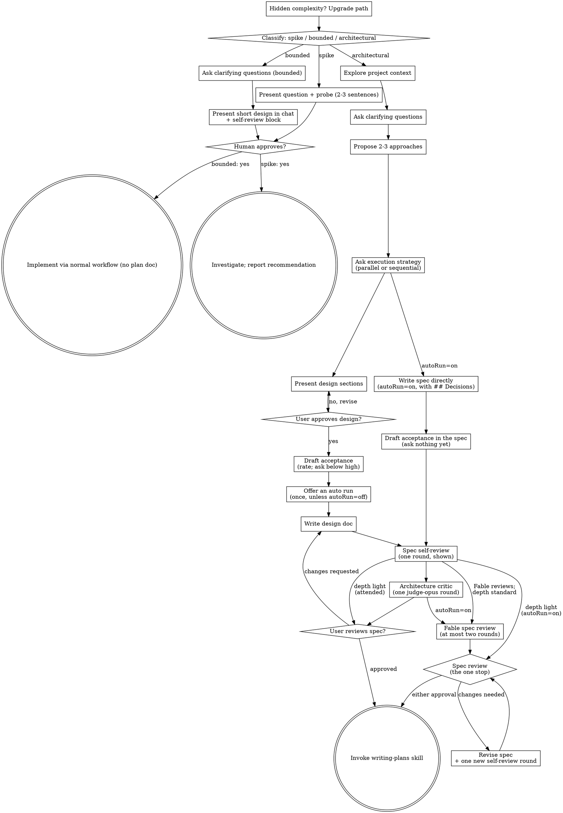

## Process Flow

```dot
digraph brainstorming {
    "Classify: spike / bounded / architectural" [shape=diamond];
    "Present question + probe (2-3 sentences)" [shape=box];
    "Ask clarifying questions (bounded)" [shape=box];
    "Present short design in chat\n+ self-review block" [shape=box];
    "Human approves?" [shape=diamond];
    "Investigate; report recommendation" [shape=doublecircle];
    "Implement via normal workflow (no plan doc)" [shape=doublecircle];
    "Explore project context" [shape=box];
    "Ask clarifying questions" [shape=box];
    "Propose 2-3 approaches" [shape=box];
    "Ask execution strategy\n(parallel or sequential)" [shape=box];
    "Present design sections" [shape=box];
    "User approves design?" [shape=diamond];
    "Draft acceptance\n(rate; ask below high)" [shape=box];
    "Offer an auto run\n(once, unless autoRun=off)" [shape=box];
    "Write design doc" [shape=box];
    "Spec self-review\n(one round, shown)" [shape=box];
    "Architecture critic\n(one judge-opus round)" [shape=box];
    "User reviews spec?" [shape=diamond];
    "Invoke writing-plans skill" [shape=doublecircle];
    "Hidden complexity? Upgrade path" [shape=box];
    "Write spec directly\n(autoRun=on, with ## Decisions)" [shape=box];
    "Draft acceptance in the spec\n(ask nothing yet)" [shape=box];
    "Fable spec review\n(at most two rounds)" [shape=box];
    "Spec review\n(the one stop)" [shape=diamond];
    "Revise spec\n+ one new self-review round" [shape=box];

    "Classify: spike / bounded / architectural" -> "Present question + probe (2-3 sentences)" [label="spike"];
    "Classify: spike / bounded / architectural" -> "Ask clarifying questions (bounded)" [label="bounded"];
    "Classify: spike / bounded / architectural" -> "Explore project context" [label="architectural"];
    "Present question + probe (2-3 sentences)" -> "Human approves?";
    "Ask clarifying questions (bounded)" -> "Present short design in chat\n+ self-review block";
    "Present short design in chat\n+ self-review block" -> "Human approves?";
    "Human approves?" -> "Investigate; report recommendation" [label="spike: yes"];
    "Human approves?" -> "Implement via normal workflow (no plan doc)" [label="bounded: yes"];
    "Hidden complexity? Upgrade path" -> "Classify: spike / bounded / architectural";
    "Explore project context" -> "Ask clarifying questions";
    "Ask clarifying questions" -> "Propose 2-3 approaches";
    "Propose 2-3 approaches" -> "Ask execution strategy\n(parallel or sequential)";
    "Ask execution strategy\n(parallel or sequential)" -> "Present design sections";
    "Present design sections" -> "User approves design?";
    "User approves design?" -> "Present design sections" [label="no, revise"];
    "User approves design?" -> "Draft acceptance\n(rate; ask below high)" [label="yes"];
    "Draft acceptance\n(rate; ask below high)" -> "Offer an auto run\n(once, unless autoRun=off)";
    "Offer an auto run\n(once, unless autoRun=off)" -> "Write design doc";
    "Write design doc" -> "Spec self-review\n(one round, shown)";
    "Spec self-review\n(one round, shown)" -> "Architecture critic\n(one judge-opus round)";
    "Architecture critic\n(one judge-opus round)" -> "User reviews spec?";
    "User reviews spec?" -> "Write design doc" [label="changes requested"];
    "User reviews spec?" -> "Invoke writing-plans skill" [label="approved"];
    "Ask execution strategy\n(parallel or sequential)" -> "Write spec directly\n(autoRun=on, with ## Decisions)" [label="autoRun=on"];
    "Write spec directly\n(autoRun=on, with ## Decisions)" -> "Draft acceptance in the spec\n(ask nothing yet)";
    "Draft acceptance in the spec\n(ask nothing yet)" -> "Spec self-review\n(one round, shown)";
    "Architecture critic\n(one judge-opus round)" -> "Fable spec review\n(at most two rounds)" [label="autoRun=on"];
    "Spec self-review\n(one round, shown)" -> "Fable spec review\n(at most two rounds)" [label="Fable reviews;\ndepth standard"];
    "Spec self-review\n(one round, shown)" -> "Spec review\n(the one stop)" [label="depth light\n(autoRun=on)"];
    "Spec self-review\n(one round, shown)" -> "User reviews spec?" [label="depth light\n(attended)"];
    "Fable spec review\n(at most two rounds)" -> "Spec review\n(the one stop)";
    "Spec review\n(the one stop)" -> "Revise spec\n+ one new self-review round" [label="changes needed"];
    "Revise spec\n+ one new self-review round" -> "Spec review\n(the one stop)";
    "Spec review\n(the one stop)" -> "Invoke writing-plans skill" [label="either approval"];
}
```
