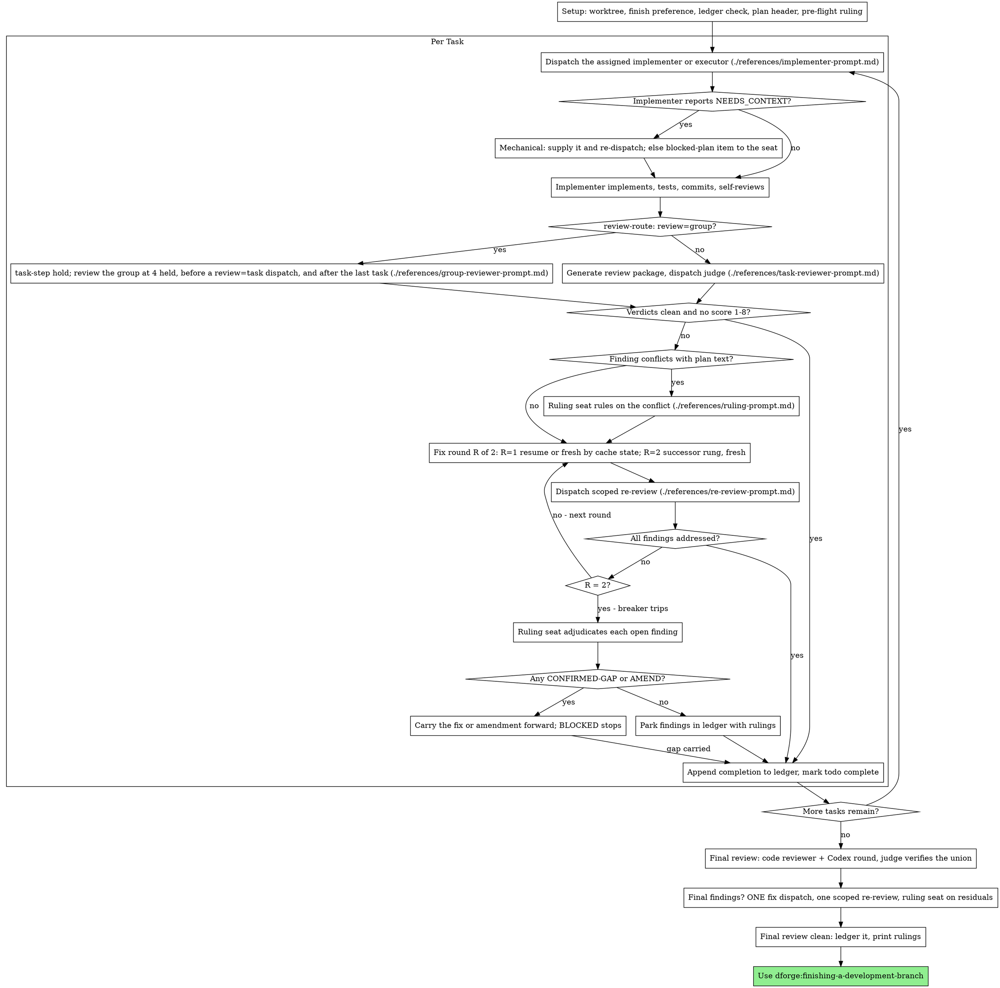

# The Process flowchart

```dot
digraph process {
    rankdir=TB;

    subgraph cluster_per_task {
        label="Per Task";
        "Dispatch the assigned implementer or executor (./references/implementer-prompt.md)" [shape=box];
        "Implementer reports NEEDS_CONTEXT?" [shape=diamond];
        "Mechanical: supply it and re-dispatch; else blocked-plan item to the seat" [shape=box];
        "Implementer implements, tests, commits, self-reviews" [shape=box];
        "review-route: review=group?" [shape=diamond];
        "task-step hold; review the group at 4 held, before a review=task dispatch, and after the last task (./references/group-reviewer-prompt.md)" [shape=box];
        "Generate review package, dispatch judge (./references/task-reviewer-prompt.md)" [shape=box];
        "Verdicts clean and no score 1-8?" [shape=diamond];
        "Finding conflicts with plan text?" [shape=diamond];
        "Ruling seat rules on the conflict (./references/ruling-prompt.md)" [shape=box];
        "Fix round R of 2: R=1 resume or fresh by cache state; R=2 successor rung, fresh" [shape=box];
        "Dispatch scoped re-review (./references/re-review-prompt.md)" [shape=box];
        "All findings addressed?" [shape=diamond];
        "R = 2?" [shape=diamond];
        "Ruling seat adjudicates each open finding" [shape=box];
        "Any CONFIRMED-GAP or AMEND?" [shape=diamond];
        "Carry the fix or amendment forward; BLOCKED stops" [shape=box];
        "Park findings in ledger with rulings" [shape=box];
        "Append completion to ledger, mark todo complete" [shape=box];
    }

    "Setup: worktree, finish preference, ledger check, plan header, pre-flight ruling" [shape=box];
    "More tasks remain?" [shape=diamond];
    "Final review: code reviewer + Codex round, judge verifies the union" [shape=box];
    "Final findings? ONE fix dispatch, one scoped re-review, ruling seat on residuals" [shape=box];
    "Final review clean: ledger it, print rulings" [shape=box];
    "Use dforge:finishing-a-development-branch" [shape=box style=filled fillcolor=lightgreen];

    "Setup: worktree, finish preference, ledger check, plan header, pre-flight ruling" -> "Dispatch the assigned implementer or executor (./references/implementer-prompt.md)";
    "Dispatch the assigned implementer or executor (./references/implementer-prompt.md)" -> "Implementer reports NEEDS_CONTEXT?";
    "Implementer reports NEEDS_CONTEXT?" -> "Mechanical: supply it and re-dispatch; else blocked-plan item to the seat" [label="yes"];
    "Mechanical: supply it and re-dispatch; else blocked-plan item to the seat" -> "Implementer implements, tests, commits, self-reviews";
    "Implementer reports NEEDS_CONTEXT?" -> "Implementer implements, tests, commits, self-reviews" [label="no"];
    "Implementer implements, tests, commits, self-reviews" -> "review-route: review=group?";
    "review-route: review=group?" -> "Generate review package, dispatch judge (./references/task-reviewer-prompt.md)" [label="no"];
    "review-route: review=group?" -> "task-step hold; review the group at 4 held, before a review=task dispatch, and after the last task (./references/group-reviewer-prompt.md)" [label="yes"];
    "task-step hold; review the group at 4 held, before a review=task dispatch, and after the last task (./references/group-reviewer-prompt.md)" -> "Verdicts clean and no score 1-8?";
    "Generate review package, dispatch judge (./references/task-reviewer-prompt.md)" -> "Verdicts clean and no score 1-8?";
    "Verdicts clean and no score 1-8?" -> "Append completion to ledger, mark todo complete" [label="yes"];
    "Verdicts clean and no score 1-8?" -> "Finding conflicts with plan text?" [label="no"];
    "Finding conflicts with plan text?" -> "Ruling seat rules on the conflict (./references/ruling-prompt.md)" [label="yes"];
    "Ruling seat rules on the conflict (./references/ruling-prompt.md)" -> "Fix round R of 2: R=1 resume or fresh by cache state; R=2 successor rung, fresh";
    "Finding conflicts with plan text?" -> "Fix round R of 2: R=1 resume or fresh by cache state; R=2 successor rung, fresh" [label="no"];
    "Fix round R of 2: R=1 resume or fresh by cache state; R=2 successor rung, fresh" -> "Dispatch scoped re-review (./references/re-review-prompt.md)";
    "Dispatch scoped re-review (./references/re-review-prompt.md)" -> "All findings addressed?";
    "All findings addressed?" -> "Append completion to ledger, mark todo complete" [label="yes"];
    "All findings addressed?" -> "R = 2?" [label="no"];
    "R = 2?" -> "Fix round R of 2: R=1 resume or fresh by cache state; R=2 successor rung, fresh" [label="no - next round"];
    "R = 2?" -> "Ruling seat adjudicates each open finding" [label="yes - breaker trips"];
    "Ruling seat adjudicates each open finding" -> "Any CONFIRMED-GAP or AMEND?";
    "Any CONFIRMED-GAP or AMEND?" -> "Carry the fix or amendment forward; BLOCKED stops" [label="yes"];
    "Carry the fix or amendment forward; BLOCKED stops" -> "Append completion to ledger, mark todo complete" [label="gap carried"];
    "Any CONFIRMED-GAP or AMEND?" -> "Park findings in ledger with rulings" [label="no"];
    "Park findings in ledger with rulings" -> "Append completion to ledger, mark todo complete";
    "Append completion to ledger, mark todo complete" -> "More tasks remain?";
    "More tasks remain?" -> "Dispatch the assigned implementer or executor (./references/implementer-prompt.md)" [label="yes"];
    "More tasks remain?" -> "Final review: code reviewer + Codex round, judge verifies the union" [label="no"];
    "Final review: code reviewer + Codex round, judge verifies the union" -> "Final findings? ONE fix dispatch, one scoped re-review, ruling seat on residuals";
    "Final findings? ONE fix dispatch, one scoped re-review, ruling seat on residuals" -> "Final review clean: ledger it, print rulings";
    "Final review clean: ledger it, print rulings" -> "Use dforge:finishing-a-development-branch";
}
```
