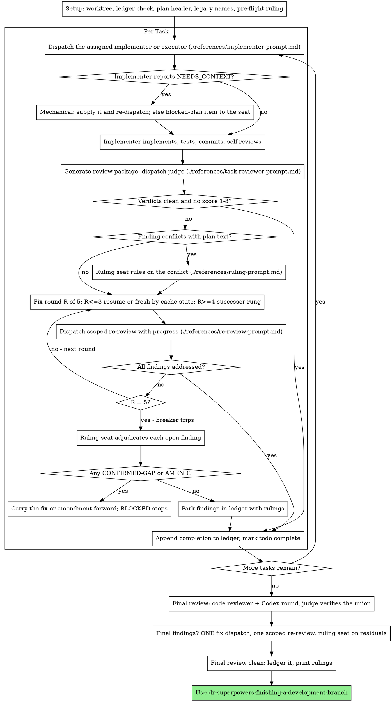

# Subagent-Driven Development

## After compaction

If this session was compacted — a compaction snapshot or summary sits above —
your memory of the run is gone, and only the start of this file may have come
back. Before anything else:

1. Run `scripts/sdd-workspace PLAN_FILE` (see using-superpowers §Session Budget),
   and read `progress.md` and `handoff.md` in
   the directory it prints.
2. Trust the ledger and `git log` over the summary. For each task the last
   ledger line decides: `complete` is done; `fix round R/5` resumes at round
   R+1 with a fresh dispatch; an assigned line with commits after its base
   goes to review.
3. Run `scripts/context-size`. On exit 5, finish the task in flight, then
   invoke dr-superpowers:handoff.
4. Re-read this skill in full before the next dispatch, and
   [delegated-task.md](../../reference/delegated-task.md) when a task is
   mid-loop (an agent-named assigned line or `fix round R/5`).

## Select the host first

Identify the host through its native tool schemas, never by which executables
are installed. On Codex, follow [native-codex.md](../../reference/native-codex.md):
its `codex-v2` protocol replaces every Claude agent and external-CLI
invocation below, including the final branch review, and carries its own
conversion, retry and reserve rules. On Claude, use the seats and loop below.

## Overview

Execute a plan by dispatching, per task, the implementer its
`**Implementer:**` line names; a judge-scored task review after each task; and
a broad whole-branch review at the end.

**Why subagents:** You delegate tasks to specialized agents with isolated context. By precisely crafting their instructions and context, you ensure they stay focused and succeed at their task. They should never inherit your session's context or history — you construct exactly what they need. This also preserves your own context for coordination work.

**Why tiered agents:** the plan records, per task, a model-and-effort pairing
chosen by the rubric in [ladder.md](../../reference/ladder.md). Each fleet agent
pins both in its frontmatter, so the tier the plan recorded is the tier that
runs, and effort — which the Agent tool cannot pass — is reachable at all.

**Core principle:** Assigned subagent per task + scored task review + broad final review = high quality, fast iteration

**Narration:** between tool calls, narrate at most one short line — the
ledger and the tool results carry the record.

**Continuous execution:** Do not pause to check in with your human partner between tasks. Execute all tasks from the plan without stopping. The only reasons to stop are the four named below, or all tasks complete. "Should I continue?" prompts and progress summaries waste their time — they asked you to execute the plan, so execute it.

**Rulings, not stalls.** A running plan does not wait on a human, and it does
not wait on your judgment either. You decide the mechanical problems yourself —
the dispatch-problems table, legacy names, resuming or re-dispatching by cache
state, batching, a report missing a required section, a tool failure — and
record each in the ledger as `Ruling: <what you decided> — <why> — <what it
costs if wrong>`, said aloud. Everything that needs judgment about the plan,
the spec or a finding goes to the ruling seat (see The Ruling Seat): it reads
the whole plan and the spec, which you never read, and returns a verdict you
carry out. A wrong ruling costs rework your human partner can see and undo; a
session parked on a question costs their whole day and buys nothing.

Four things stop you, and only these: an irreversible or destructive
operation; a security-sensitive action; a side effect outside this worktree
that norms say you ask about first (a merge, a push to a shared branch, a
publish); and a ruling-seat `BLOCKED` verdict — a plan so broken that every
path forward is a guess. For those, stop and ask.

**Every session ends with the next step.** Whenever this session ends before
the plan is finished — one of those four stops, a context-budget handoff, or
your human partner asking you to stop — run `scripts/next-step PLAN_FILE`
(see using-superpowers §Session Budget) as your last
action. The last thing in your final message is the block it prints,
verbatim. It also rewrites the `## Next session` section of the primary
checkout's `.superpowers/handoff/latest.md`; if it exits 4, say the handoff
file could not be written. When the plan finishes,
dr-superpowers:finishing-a-development-branch runs it instead.

## When to Use

When a plan's `**Execution:**` line names `subagent`. Without a plan, use
dr-superpowers:brainstorming first; with a line that names `inline`, use
dr-superpowers:executing-plans. What this mode adds over inline is a fresh
implementer per task and a judge-scored review after each one.

The plan's `**Execution:**` line decides the mode. Your human partner's explicit
instruction switches it in either direction, and only at a task boundary where
every earlier task is complete, recorded as a `Ruling:` line. Inline mode also
escalates here on its own when a task will not converge; it arrives with a
`Task <N>: escalated inline -> subagent` ledger line, and the Recovery table
below says what to do with it.

## The Process



## Setup

Ensure the work happens in an isolated workspace: use
dr-superpowers:using-git-worktrees to create one or verify the existing one.
Never start implementation on a main/master branch without your human
partner's explicit consent.

Conversation memory does not survive compaction. In real sessions,
controllers that lost their place have re-dispatched entire completed task
sequences — the single most expensive failure observed. Track progress in
a ledger file, not only in todos.

- Each plan owns a workspace: at skill start, run
  `scripts/sdd-workspace PLAN_FILE` (see using-superpowers §Session Budget) — it prints the plan's git-ignored
  directory (`<repo-root>/.superpowers/sdd/<plan-basename>/`), home to
  every artifact for THIS plan: ledger, briefs, reports, review packages.
  Another plan's directory is never yours to read or write.
- Check for this plan's ledger at `<workspace>/progress.md`. If its first
  line names your plan file, recover each task's state with the Recovery
  table under The Ledger. A ledger whose first line names a different plan
  file — or a stray ledger at the old flat path `.superpowers/sdd/progress.md`
  — is another plan's progress: leave it in place and start your own, fresh.
- Create the ledger with its identity as the first line:
  `# SDD ledger — plan: <plan file path>` — the path exactly as you pass it to
  the scripts (checkout-relative or absolute; `next-step` resolves both).
- Create `<workspace>/handoff.md` from the template in dr-superpowers:handoff
  if it does not exist. Update it in the same message as a ledger write
  whenever an owner constraint, gotcha, prohibition or open question changes —
  not after every task.
- Read `docs/superpowers/distilled/constraints.md` when the project has one. Its
  entries bind like the owner constraints in `handoff.md` and yield to them
  wherever both speak; an absent file is not an error. See
  [project-state.md](../../reference/project-state.md).
- The ledger is your recovery map: the commits it names exist in git even
  when your context no longer remembers creating them. After compaction,
  trust the ledger and `git log` over your own recollection.
- `git clean -fdx` will destroy the workspace (it's git-ignored scratch); if
  that happens, recover from `git log`.

Read the plan's header, never the whole plan: run
`scripts/task-brief --header PLAN_FILE` (see using-superpowers §Session Budget), and read the
file it prints (`<workspace>/plan-header.md`). Note the Execution line, the
Global Constraints and the Contracts, and create a todo per Task index entry.
A plan written before 1.4.0 may have no Task index: then run
`scripts/task-brief PLAN_FILE N` for N = 1, 2, … until it exits 3, and take
each task's title from its brief's first line. You never read the spec: the
ruling seat, the plan review and the final review do. If the plan's
`**Spec:**` path is unreachable, note it in the ledger and say so in every
ruling-seat dispatch; the seat marks its rulings provisional.

**Resolve legacy names.** Plans written before this plugin's 1.2.0 may name
skills and agents under older plugin prefixes, in the header and in
`**Implementer:**` lines. Translate each with
[legacy-names.md](../../reference/legacy-names.md) at read time, never edit the
plan, and log one `Ruling: translated <old> -> <new> — legacy plugin name —
none` per distinct name. A header demanding the retired tiered-dispatch skill
needs nothing further: this skill reads the `**Implementer:**` lines itself.

Before dispatching Task 1, send one `preflight` item to the ruling seat (see
The Ruling Seat). It scans the whole plan against the spec for:

- tasks that contradict each other, the Contracts, or the Global Constraints
- anything the plan explicitly mandates that the review rubric treats as a
  defect (a test that asserts nothing, verbatim duplication of a logic block)

The seat returns a table, not a verdict: one row for every pair of tasks that
share a file or an interface, and one row for every task on whether its own
text agrees with itself. Verdict blocks follow for the rows that found
something. Write the whole output to `<workspace>/preflight.md`, carry out
each verdict, log `Ruling: pre-flight — <clean | K findings, see
preflight.md> — none`, and dispatch Task 1. A resumed ledger that already
holds that line skips the dispatch. The review loop remains the net for
conflicts that only emerge from implementation.

## Seats

Every seat is named, so nothing silently inherits your session's model.

| Seat | Agent | Model argument |
|---|---|---|
| Ruling seat | The seat `scripts/review-route PLAN_FILE --ruling <kind> [<task> ...]` prints (The Ruling Seat); `dr-superpowers:judge-opus` in place of `judge-fable` when Fable is unavailable or your human partner declined it, said aloud | None |
| Final review | The seat `scripts/review-route PLAN_FILE --final` prints ([final-review.md](../../reference/final-review.md) step 1); its `fallback` when Fable is unavailable or your human partner declined it, said aloud | None |
| Final fix wave | The implementer `scripts/review-route PLAN_FILE --final-fix <file> ...` prints ([final-review.md](../../reference/final-review.md) §Fixing what it finds) | None |

The implementer, external implementer, task reviewer and scoped re-review seats,
and the rule that fleet agents take no `model` argument, are in
[delegated-task.md](../../reference/delegated-task.md) §Seats.

**General-purpose seats always take an explicit model.** An omitted model
inherits your session's model — often the most capable and most expensive —
which silently defeats the choice. Scoped re-reviews of small fix diffs take a
cheap-to-mid tier; a subtle concurrency fix takes more.

## The Ledger

This skill owns every line in `<workspace>/progress.md`. The grammar:

```
# SDD ledger — plan: <path>
Task <N>: implementer <agent> (assigned; base <sha7>[; part A][; reserve tier][; scored at dispatch][; executor codex <m>/<e>, thread <id>][; escalated from <old>: BLOCKED][; <substitution>])
Task <N>: fix round R/5 (X addressed, Y open — <one-liners>; commits a..b[; progress p -> q]; resumed | fresh (<why>) | escalated <old> -> <new> | HANDBACK to <agent>)
Group <a>-<b>: review round R/5 (<same fields as a fix round>)
Task <N>: escalated inline -> subagent — <trigger>          (written by inline mode only)
Task <N>: minor (deferred): <one-liner>
Task <N>: parked — <finding> — Ruling: <why the code stands>
Task <N>: Ruling: <finding> — <what was decided and why>
Task <N>: BLOCKED — <agent> exhausted — <what a human must decide>
Task <N>: BLOCKED — ruling seat — <what a human must decide>
Task <N>: Ruling: amendment A<k> — <reason> — <cost if wrong>
Ruling: amendment A<k> (Header) — <reason> — <cost if wrong>
Task <N>: complete (commits a..b, review clean | K parked[; parts A, B][; scores spec s / scope c / verification v / quality q, seat <seat>]) — done: …; verified: <command → result>; remaining: none | <parked>; discovered: none | …; assumptions: none | …
Ruling: <what> — <why> — <cost if wrong>
Final fix: implementer <agent> (assigned; base <sha7>)
Final review: clean (commits <merge-base7>..<head7>[, K parked])
```

- Every task gets its own assigned line and its own complete line, including
  tasks reviewed as a batch. Batches are contiguous task ranges so
  `Group <a>-<b>` names them; only a batch's review rounds log on its Group
  line.
- The scores clause is present whenever a review seat, Codex or judge, scored the task.
- The checkpoint after the `—` comes from the report's
  `## Discovered issues (not fixed)` and `## Assumptions made` sections — the
  implementer's or the Codex wrapper's. `done` is a one-line summary of the
  task's deliverable, `verified` the covering command and its result, and
  `remaining` the parked findings. A batch report's sections are copied onto
  each task's complete line, attributed per task where the report names one.
- Write each line in the same message as your other bookkeeping, never later.
- A ruling-seat `BLOCKED` that belongs to no task (a `preflight` row, a
  Header amendment) is logged against the lowest-numbered task without a
  complete line, so recovery reads it as that task's terminal line.

**Recovery.** For task N, take the last line in file order among its
`Task <N>:` lines and any `Group` line covering N, stepping over
`minor (deferred)`, `parked`, `Task <N>: Ruling:`, and bare `Ruling:` lines.
Then:

| Last line | Action |
|---|---|
| `complete` | Done; never re-dispatch |
| `BLOCKED` | Terminal; never re-dispatch. It is a stop of the fourth class for any task that depends on it; name it in your final message |
| `review round R/5` on a `Group` line, R < 5 | Resume the batch's loop at round R+1 — after compaction the agent id is gone, so the cache rule makes it a fresh dispatch |
| `review round 5/5` on a `Group` line | Go to the breaker |
| `escalated inline -> subagent` | Inline mode escalated this task here. Dispatch the first rung on the escalation table ranked strictly above both the task's `**Implementer:**` agent and the inline session's rung, the successor of whichever ranks higher ([escalation.md](references/escalation.md) §Escalating out of inline mode) fresh at round 1 of 5, with the brief and the task's preceding fix-round lines; the inline session already spent three rounds at or above the assigned tier, and the task's earlier commits are in `git log` |
| `implementer <agent> (assigned …)` or `fix round R/5` | Apply [delegated-task.md](../../reference/delegated-task.md) §Recovery |
| none | Not started |

A ledger written by an older version of this skill may carry an assigned line
without `base`: take the previous task's complete-line head, or the branch's
merge base for Task 1. An old `(scored at dispatch)` line reads as assigned.

**Plan state.** Every task complete and no `Final review:` line: go to Final
Review. A `Final fix:` line and no `Final review:` line: the fix wave was
dispatched; after compaction the agent id is gone, so re-dispatch that agent
fresh, then continue Final Review at the scoped re-review. A
`Final review: clean` line: the review is done — go to
dr-superpowers:finishing-a-development-branch.

## The Ruling Seat

Judgment belongs to the ruling seat, never to you, whatever model you run on.
It reads the whole plan, the spec, `amendments.md` and the ledger; you read
the header and one brief at a time.

**When.** Send the seat an item at each of these points, batching every item
that arises at one point into one dispatch:

| Kind | Decision point |
|---|---|
| `preflight` | Once, before Task 1 (Setup) |
| `plan-conflict` | A review finding labelled plan-mandated, or one that conflicts with what the plan's text requires |
| `cannot-verify` | Every "⚠️ Cannot verify from diff" item, before the task completes |
| `breaker` | Every finding still open after round 5/5 |
| `blocked-plan` | An implementer BLOCKED because the plan is wrong |
| `codex-empty-diff` | A Codex fix round that returned DONE with an empty diff and an argument ([external-executor.md](../../reference/external-executor.md)) |
| `final-residual` | Findings still open after the final review's one fix wave |

**How.** Write `<workspace>/rulings-<point>-<task>.md` — `<task>` is the task
number the items concern, or `plan` for a plan-level point, so a recurring
point never overwrites an earlier file — listing each item: an id, its
kind, its task (or `plan`), and the paths it needs — brief, report, review
packages — with the findings copied verbatim. Run
`scripts/review-route PLAN_FILE --ruling <kind> [<task> ...]` for the point's
kind and the tasks its items concern, and dispatch the `primary` it prints
(`judge-opus` in place of `judge-fable` when Fable is unavailable or your human
partner declined it, said aloud) with
[ruling-prompt.md](references/ruling-prompt.md), expanding its placeholders.
Items of different kinds at one point take `judge-fable` if any kind's route
prints it. On any exit 2, dispatch `dr-superpowers:judge-opus` and say why,
quoting its message. Codex hosts, where `review-route` exits 2, use a native
judge at Astra high or above ([native-codex.md](../../reference/native-codex.md)).

**Carry out each verdict**, and copy its `Ruling:` line into the ledger
verbatim:

- **CONFIRMED-GAP** — the finding is real. Mid-task it enters the fix loop
  with the ruling's smallest fix in the fix message. At the breaker it is
  logged `Task <N>: Ruling: <finding> — <ruling>` and carried into the next
  dependent task's dispatch.
- **PARK** — log `Task <N>: parked — <finding> — Ruling: <why>`; the code
  stands.
- **AMEND** — copy the entry, from its `## A?` line through the New fence's
  closing line, to `<workspace>/amend-<id>.md` and run
  `scripts/plan-amend PLAN_FILE <workspace>/amend-<id>.md`, from the plugin
  root. On `amended: A<k> …`, write the amendment ledger line; the next
  dispatch uses a fresh `task-brief`, which carries the amendment. On
  `rejected: …`, make one fresh seat dispatch carrying the entry and the
  rejection output; a second rejection is BLOCKED.

  **A Header amendment from `judge-opus` is confirmed first.** Before
  `plan-amend`, write `<workspace>/rulings-<point>-<task>-confirm.md`: the
  original item entry unchanged, then the Opus verdict block verbatim. Dispatch
  `dr-superpowers:judge-fable` directly, not through `review-route`, with the
  same template and `[CONFIRM_NOTE]` filled. Fable's verdict replaces the Opus
  verdict and is carried out like any verdict; the one fresh dispatch after a
  `rejected:` goes to `judge-fable` too. Log `Ruling: header amendment A<k>
  confirmed by judge-fable — <Fable's verdict> — if wrong, the plan's Global
  Constraints or Contracts carry a bad rule into every later task`. When Fable
  is unavailable or declined, skip the confirmation and never hand it to Opus:
  apply the Opus verdict and log `Ruling: header amendment A<k> unconfirmed —
  Fable unavailable — if wrong, the plan's Global Constraints or Contracts carry
  a bad rule into every later task`.
- **BLOCKED** — log `Task <N>: BLOCKED — ruling seat — <decision>`, name it
  in your final message, and stop.

Never soften, merge or second-guess a verdict. If you think the seat is
wrong, carry the verdict out anyway: the ledger line is where your human
partner sees it.

## Session Budget

`scripts/task-brief` and `scripts/review-package` end their output with the
budget line ([session-budget.md](../../reference/session-budget.md)), so you
check the session budget before every task and every review at no extra
request:

    budget: 312k of 465k (67%) — ok — source: record

- `ok` or `unknown`: carry on, however high the percentage. Only the verdict
  stops you.
- `handoff`: finish the task in flight — its reviews, fix rounds and
  `Task N: complete` line — then invoke dr-superpowers:handoff. Start no new
  task. The budget holds one task's worst growth, so the task lands before
  compaction.
- After the last task's `Task N: complete` line, run `scripts/context-size`.
  On `ok` or `unknown`, continue to Final Review in this session; on exit 5,
  invoke dr-superpowers:handoff, and dr-superpowers:resume-execution brings
  the next session to Final Review.
- On Codex there is no budget line: hand off after every 3 completed tasks, or
  after any task that needed 3 or more fix rounds.

## The Task Loop

**Batch small same-shape work.** When the plan lists several contiguous tasks
that are each a small, independent edit of the same kind — the same one-line
fix, constant change, or field addition repeated across files — do not
dispatch one subagent per task. Compose ONE dispatch brief listing every file
and its change, send the whole batch to a single subagent (the highest tier any
of its tasks names), and review its diff as one unit. Reserve
one-dispatch-per-task for work that needs its own judgment, its own tests, or
its own review surface. A batched task never runs on an external executor.
Decide batching from the briefs of the contiguous candidate tasks, extracted
with `task-brief`; you never read task text any other way.

Everything you paste into a dispatch prompt — and everything a subagent
prints back — stays resident in your context for the rest of the session
and is re-read on every later turn. Hand artifacts over as files.

**Waiting on dispatched subagents:** never poll a wait interface with
short timeouts, and never sit in one silent, open-ended wait either.
While you have local work — ledger updates, packaging the next review,
reading reports — keep working; child results arrive on their own.
When you are genuinely idle, wait in bounded stretches (five to ten
minutes, where your platform allows), and between stretches post one
line of status and reconcile your live children: list them, and chase
any that finished without reporting. A bounded stretch keeps nearly
all of a long wait's efficiency while guaranteeing a stuck or lost
child is noticed within minutes, not at the end of the session.

For each task, or batch, run [delegated-task.md](../../reference/delegated-task.md):
dispatch the implementer, handle the report, review the task, the fix loop and
the complete line. Its contract names what the loop needs from you.

## Final Review

This runs in the session that completed the last task, unless the budget
line said `handoff` there; then dr-superpowers:resume-execution brought the
next session here.

Follow [final-review.md](../../reference/final-review.md), the procedure both
execution skills share. Point the reviewer at the ledger's deferred-minor and
parked lines, the complete lines' `discovered:` fields, and every borderline
(9-13) score, so it can triage which findings must be fixed before merge.

## Finish

Before you leave this skill, collect every ledger line containing `Ruling:` —
preflight rulings, dispatch rulings, translations, parked findings, ruling-seat
verdicts, all of them — into your final message under "Rulings I made",
in the order you made them, each with what it costs if wrong. The list is
exhaustive: if the ledger holds a ruling, the list holds it. That list is the
only place the decisions you took on your human partner's behalf reach them —
they read it and rework whatever you got wrong. A ruling that dies with the
workspace was a decision made in secret. Name every `BLOCKED` task there too.

Then, under "Amendments made", print every entry of `<workspace>/amendments.md`
in full, if the file exists. The workspace is deleted after a merge, so this
printed list is the only lasting record of how the plan changed during
execution.

When the final whole-branch review is clean and its fixes are committed,
append `Final review: clean (commits <merge-base7>..<head7>[, K parked])` to
the ledger in the same message as printing the rulings. Do not delete the
workspace: dr-superpowers:finishing-a-development-branch removes it with the
worktree once the work is merged or discarded, and until then it is what a
later session resumes from. Then continue to finishing — unless the last
budget line said `handoff`, in which case invoke dr-superpowers:handoff.

Use dr-superpowers:finishing-a-development-branch.

## Common Rationalizations

| Excuse | Reality |
|--------|---------|
| "Close enough on spec compliance" | Reviewer found spec gaps = not done. Fix, or hit the cap and send it to the ruling seat — those are the only exits. |
| "I'll fix it myself, dispatching is overhead" | Controller fixes pollute your context and skip review. Resume or re-dispatch the implementer. |
| "One more round will converge" | Past the cap, rounds don't converge — the failure is structural. Send it to the breaker and carry out the seat's verdicts. |
| "The reviewer will just find something new anyway" | Scoped re-reviews verify fixes; they cannot wander. New findings on untouched code go to the ledger, not the loop. |
| "This finding is obviously wrong, I'll drop it" | The ruling seat adjudicates, only at the cap, and every verdict is a ledger entry. Silent discards are forbidden. |
| "I can see the plan is wrong, I'll rule on it myself" | You read the header and one brief; the seat reads the plan and the spec. Send it a plan-conflict item. |
| "The fix was small, skip the re-review" | Unreviewed fixes are how regressions land. Every round ends with a scoped re-review. |
| "Reviews slow the loop down" | The loop without reviews is just unverified churn. Reviews are the loop's brakes and steering. |
| "The budget is at 89%, I'll hand off before the next task" | `ok` means continue. Only a `handoff` verdict stops the loop, and even then the task in flight finishes first. |
| "Ledger bookkeeping is overhead" | The ledger is what survives compaction. Controllers without one have re-dispatched entire completed task sequences. |
| "The implementer spawned its own reviewer — free extra assurance" | It's a duplicate seat reviewing the same diff; the task review is the gate. A worker-spawned reviewer is a defect to flag, not rigor. |
| "I'll pass a model to be safe" | On a fleet agent it overrides the pinned model while effort stays — a tier the ledger never records. |
| "Resuming is always cheaper" | A cold resume re-writes the whole context into the cache. Past five minutes and 100k tokens, a fresh dispatch with the report file is cheaper. |
| "The agent name looks wrong, I'll just use the session default" | A silent fallback hides every tier the plan recorded. Rule, log it, say it aloud. |

## Example Workflow

```
You: I'm using Subagent-Driven Development to execute this plan.

[Setup: worktree verified]
[task-brief --header docs/superpowers/plans/feature-plan.md; read plan-header.md, never the whole plan]
[Resolve workspace: scripts/sdd-workspace docs/superpowers/plans/feature-plan.md — no ledger inside, fresh start]
[Create todos for all tasks]
[Pre-flight: ruling seat returns preflight.md — clean; ledger the pre-flight ruling]

Task 1: Hook installation script  (**Implementer:** dr-superpowers:impl-sonnet-low)

[BASE=a1b2c3d; run task-brief for Task 1; dispatch impl-sonnet-low, no model argument]
[Ledger: Task 1: implementer impl-sonnet-low (assigned; base a1b2c3d)]

Implementer: DONE — 5/5 passing; report file written; assumptions: user-level install (brief silent)

[date +%s; review-package PLAN_FILE a1b2c3d HEAD; review-route --task 1 prints judge-sonnet-high; dispatch it with the printed path]
Judge: Spec ✅. Task quality: Approved.
  Verification Scores: spec 17 / scope 18 / verification 16 / quality 16

[Ledger: Task 1: complete (commits a1b2c3d..d4e5f6a, review clean; scores spec 17 / scope 18 / verification 16 / quality 16) — done: install-hook command; verified: node --test test/hook.test.js → 5/5; remaining: none; discovered: none; assumptions: user-level install]

Task 2: Recovery modes  (**Implementer:** dr-superpowers:impl-sonnet-medium)

[BASE=d4e5f6a; dispatch impl-sonnet-medium]
Implementer: DONE — 8/8 passing

[date +%s → t0; review-package; review-route --task 2; dispatch judge-sonnet-high]
Judge: Spec ❌ — missing progress reporting. Important: magic number (100).
  Verification Scores: spec 7 / scope 17 / verification 15 / quality 12

[date +%s → t1; t1 − t0 = 140s, so resume the implementer with both findings]
Implementer: Added progress reporting, extracted PROGRESS_INTERVAL. 10/10 passing.

[date +%s; review-package PLAN_FILE FIX_BASE HEAD; dispatch scoped re-review]
Re-reviewer: both ADDRESSED. New breakage: none. Progress: 18

[Ledger: Task 2: fix round 1/5 (2 addressed, 0 open; commits d4e5f6a..b7c8d9e; progress - -> 18; resumed)]
[Ledger: Task 2: complete (commits d4e5f6a..b7c8d9e, review clean; scores spec 16 / scope 17 / verification 15 / quality 15) — …]

...

[After the last task's complete line: context-size says ok — continue to Final Review]
[final-review.md: package the branch; review-route --final prints judge-opus for this plain plan; Codex round in the background]
[judge-fable dedupes and verifies the union: 1 CONFIRMED (both), 1 REJECTED]
[ONE fix dispatch; one scoped re-review; clean]

[Ledger: Final review: clean (commits a1b2c3d..f0e1d2c); print Rulings I made; budget ok — continue]

Done! Using dr-superpowers:finishing-a-development-branch.
```
