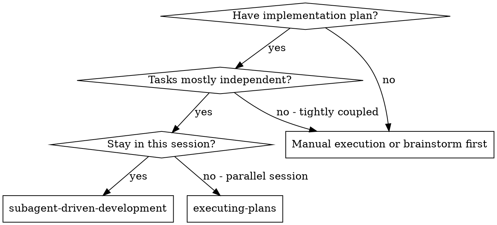
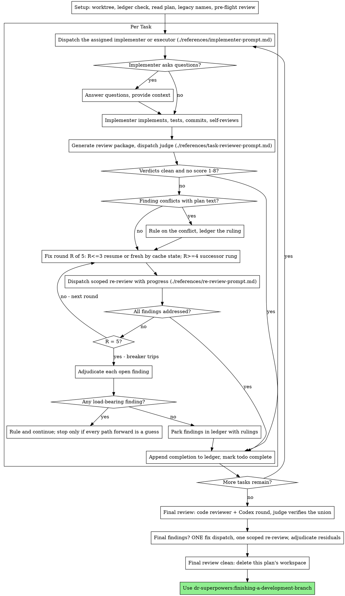

# Subagent-Driven Development

## Select the host first

Identify the host through its native tool schemas. On Codex, follow
[native-codex.md](../../reference/native-codex.md): its `codex-v2`
dispatch/review protocol replaces every Claude agent and external-CLI
invocation below, including the final branch review. Supply the raw axes for
rubric selection; validate any recorded weighted 0–9 score. Old policy versions
require explicit conversion before dispatch. Preserve the raw risk axis for
three independent risk-3 evaluations, criteria, progress triggers, and the
five-round review cap. Reuse recorded assignments for transport retries; never
clear attempt history to rerun initial selection or escape exhausted reserve.
On Claude, use the seats and loop below. The presence of a Codex executable does
not identify the host. Missing native tools, advertised model metadata, or
required skills block dispatch with a named prerequisite. Honor any user
instruction to execute inline.

## Overview

Execute a plan by dispatching, per task, the implementer its
`**Implementer:**` line names; a judge-scored task review after each task; and
a broad whole-branch review at the end.

**Why subagents:** You delegate tasks to specialized agents with isolated context. By precisely crafting their instructions and context, you ensure they stay focused and succeed at their task. They should never inherit your session's context or history — you construct exactly what they need. This also preserves your own context for coordination work.

**Why tiered agents:** the plan records, per task, a model-and-effort pairing
chosen by the rubric in [ladder.md](../../reference/ladder.md). Each fleet agent
pins both in its frontmatter, so the tier the plan recorded is the tier that
runs, and effort — which the Agent tool cannot pass — is reachable at all.

**Core principle:** Assigned subagent per task + scored task review + broad final review = high quality, fast iteration

**Narration:** between tool calls, narrate at most one short line — the
ledger and the tool results carry the record.

**Continuous execution:** Do not pause to check in with your human partner between tasks. Execute all tasks from the plan without stopping. The only reasons to stop are the four named below, or all tasks complete. "Should I continue?" prompts and progress summaries waste their time — they asked you to execute the plan, so execute it.

**Rulings, not stalls.** A running plan does not wait on a human. Conflicts,
ambiguities, plan defects, a cap you would have asked to exceed, a dispatch
problem — decide them. The spec is the binding authority, the plan is its
argument, and your judgment settles what neither answers. Record every decision
in the ledger as `Ruling: <what you decided> — <why> — <what it costs if
wrong>`, say it aloud, and keep going. A wrong ruling costs rework your human
partner can see and undo; a session parked on a question costs their whole day
and buys nothing.

Four things stop you, and only these: an irreversible or destructive
operation; a security-sensitive action; a side effect outside this worktree
that norms say you ask about first (a merge, a push to a shared branch, a
publish); and a plan so broken that every path forward is a guess. For those,
stop and ask.

**Every session ends with the next step.** Whenever this session ends before
the plan is finished — one of those four stops, a context-budget handoff, or
your human partner asking you to stop — run `scripts/next-step PLAN_FILE`,
from the plugin root (two levels above this skill's directory), as your last
action. The last thing in your final message is the block it prints,
verbatim. It also rewrites the `## Next session` section of the primary
checkout's `.superpowers/handoff/latest.md`; if it exits 4, say the handoff
file could not be written. When the plan finishes,
dr-superpowers:finishing-a-development-branch runs it instead.

## When to Use



**vs. Executing Plans (parallel session):**
- Same session (no context switch)
- Fresh subagent per task (no context pollution)
- Review after each task (spec, scope, verification, quality), broad review at the end
- Faster iteration (no human-in-loop between tasks)

Mode switches between this skill and dr-superpowers:executing-plans happen only
at a task boundary where every earlier task is complete, recorded as a
`Ruling:` line.

## The Process



## Setup

Ensure the work happens in an isolated workspace: use
dr-superpowers:using-git-worktrees to create one or verify the existing one.
Never start implementation on a main/master branch without your human
partner's explicit consent.

Conversation memory does not survive compaction. In real sessions,
controllers that lost their place have re-dispatched entire completed task
sequences — the single most expensive failure observed. Track progress in
a ledger file, not only in todos.

- Each plan owns a workspace: at skill start, run
  `scripts/sdd-workspace PLAN_FILE`, from the plugin root (two levels
  above this skill's directory) — it prints the plan's git-ignored
  directory (`<repo-root>/.superpowers/sdd/<plan-basename>/`), home to
  every artifact for THIS plan: ledger, briefs, reports, review packages.
  Another plan's directory is never yours to read or write.
- Check for this plan's ledger at `<workspace>/progress.md`. If its first
  line names your plan file, recover each task's state with the Recovery
  table under The Ledger. A ledger whose first line names a different plan
  file — or a stray ledger at the old flat path `.superpowers/sdd/progress.md`
  — is another plan's progress: leave it in place and start your own, fresh.
- Create the ledger with its identity as the first line:
  `# SDD ledger — plan: <plan file path>`.
- The ledger is your recovery map: the commits it names exist in git even
  when your context no longer remembers creating them. After compaction,
  trust the ledger and `git log` over your own recollection.
- `git clean -fdx` will destroy the workspace (it's git-ignored scratch); if
  that happens, recover from `git log`.

Read the plan once, note its context and Global Constraints, and create a
todo per task. If the plan names a Spec, read that too: the spec is the
authority the plan argues from, and conflicts inside the plan resolve
against it. A plan with no reachable spec gets a ledger note saying so —
rulings made without one are provisional.

**Resolve legacy names.** Plans written before this plugin's 1.2.0 may name
skills and agents under older plugin prefixes, in the header and in
`**Implementer:**` lines. Translate each with
[legacy-names.md](../../reference/legacy-names.md) at read time, never edit the
plan, and log one `Ruling: translated <old> -> <new> — legacy plugin name —
none` per distinct name. A header demanding the retired tiered-dispatch skill
needs nothing further: this skill reads the `**Implementer:**` lines itself.

Before dispatching Task 1, scan the plan once for conflicts, writing down
what you checked as you check it:

- tasks that contradict each other or the plan's Global Constraints
- anything the plan explicitly mandates that the review rubric treats as a
  defect (a test that asserts nothing, verbatim duplication of a logic block)

The scan's output is a table, not a verdict. One row for every pair of tasks
that share a file or an interface: the two tasks, what one produces against
what the other consumes, and what you found. One row for every task: whether
its own text agrees with itself — the tests it specifies against the code it
specifies, the files it creates against the files it later touches. "The scan
is clean" without those rows is not a scan you ran.

Write the table to the ledger. Rule on everything you find before execution
begins — each finding against the plan text that mandates it — and record
each ruling in the ledger. If the scan is clean, proceed without comment.
Rule on each conflict it surfaces — the spec is the binding authority, the
plan is its argument — record the ruling beside its row, and dispatch
Task 1. The review loop remains the net for conflicts that only emerge from
implementation.

## Seats

Every seat is named, so nothing silently inherits your session's model.

| Seat | Agent | Model argument |
|---|---|---|
| Implementer | The task's `**Implementer:**` agent, as `subagent_type` | None |
| External implementer | The task's `**Executor:**` line, via [external-executor.md](../../reference/external-executor.md) | Set by the wrapper |
| Task reviewer | `dr-superpowers:judge-fable`; `dr-superpowers:judge-opus` when Fable is unavailable or your human partner declined it — say the substitution aloud | None |
| Scoped re-review | general-purpose | Explicit, cheap-to-mid |
| Final review | general-purpose | Explicit, most capable available |

**Fleet agents take no `model` argument.** The Agent tool's `model` argument
overrides the agent file's pinned model while `effort` keeps its frontmatter
value, so passing one runs the agent at a tier the ledger does not record — and,
for a judge seat, silently bypasses the Fable-unavailable rule, which requires
you to say the substitution aloud.

**General-purpose seats always take an explicit model.** An omitted model
inherits your session's model — often the most capable and most expensive —
which silently defeats the choice. Scoped re-reviews of small fix diffs take a
cheap-to-mid tier; a subtle concurrency fix takes more. The final whole-branch
review takes the most capable available model.

**Turn count beats token price.** Wall-clock and context cost scale with how
many turns a subagent takes, and the cheapest models routinely take 2-3× the
turns on multi-step work. Use a mid-tier model as the floor for reviewers.

## The Ledger

This skill owns every line in `<workspace>/progress.md`. The grammar:

```
# SDD ledger — plan: <path>
Task <N>: implementer <agent> (assigned; base <sha7>[; reserve tier][; scored at dispatch][; executor codex <m>/<e>, thread <id>][; escalated from <old>: BLOCKED][; <substitution>])
Task <N>: fix round R/5 (X addressed, Y open — <one-liners>; commits a..b[; progress p -> q]; resumed | fresh (<why>) | escalated <old> -> <new> | HANDBACK to <agent>)
Group <a>-<b>: review round R/5 (<same fields as a fix round>)
Task <N>: minor (deferred): <one-liner>
Task <N>: parked — <finding> — Ruling: <why the code stands>
Task <N>: Ruling: <finding> — <what was decided and why>
Task <N>: BLOCKED — <agent> exhausted — <what a human must decide>
Task <N>: complete (commits a..b, review clean | K parked[; scores spec s / scope c / verification v / quality q[, K=3]]) — done: …; verified: <command → result>; remaining: none | <parked>; discovered: none | …; assumptions: none | …
Ruling: <what> — <why> — <cost if wrong>
```

- Every task gets its own assigned line and its own complete line, including
  tasks reviewed as a batch. Batches are contiguous task ranges so
  `Group <a>-<b>` names them; only a batch's review rounds log on its Group
  line.
- The scores clause is present whenever a judge scored the task.
- The checkpoint after the `—` comes from the report's
  `## Discovered issues (not fixed)` and `## Assumptions made` sections — the
  implementer's or the Codex wrapper's. `done` is a one-line summary of the
  task's deliverable, `verified` the covering command and its result, and
  `remaining` the parked findings. A batch report's sections are copied onto
  each task's complete line, attributed per task where the report names one.
- Write each line in the same message as your other bookkeeping, never later.

**Recovery.** For task N, take the last line in file order among its
`Task <N>:` lines and any `Group` line covering N, stepping over
`minor (deferred)`, `parked`, `Task <N>: Ruling:`, and bare `Ruling:` lines.
Then:

| Last line | Action |
|---|---|
| `complete` | Done; never re-dispatch |
| `BLOCKED` | Terminal; never re-dispatch. It is a stop of the fourth class for any task that depends on it; name it in your final message |
| `fix round R/5` or `review round R/5`, R < 5 | Resume the loop at round R+1 — after compaction the agent id is gone, so the cache rule makes it a fresh dispatch |
| `fix round 5/5` or `review round 5/5` | Go to the breaker and adjudicate |
| `implementer … (assigned …)` | If the report file has a status and `git log <base>..HEAD` is non-empty, review it; otherwise dispatch the same agent fresh |
| none | Not started |

A ledger written by an older version of this skill may carry an assigned line
without `base`: take the previous task's complete-line head, or the branch's
merge base for Task 1. An old `(scored at dispatch)` line reads as assigned.

## The Task Loop

**Batch small same-shape work.** When the plan lists several contiguous tasks
that are each a small, independent edit of the same kind — the same one-line
fix, constant change, or field addition repeated across files — do not
dispatch one subagent per task. Compose ONE dispatch brief listing every file
and its change, send the whole batch to a single subagent (the highest tier any
of its tasks names), and review its diff as one unit. Reserve
one-dispatch-per-task for work that needs its own judgment, its own tests, or
its own review surface. A batched task never runs on an external executor.

Everything you paste into a dispatch prompt — and everything a subagent
prints back — stays resident in your context for the rest of the session
and is re-read on every later turn. Hand artifacts over as files.

**Waiting on dispatched subagents:** never poll a wait interface with
short timeouts, and never sit in one silent, open-ended wait either.
While you have local work — ledger updates, packaging the next review,
reading reports — keep working; child results arrive on their own.
When you are genuinely idle, wait in bounded stretches (five to ten
minutes, where your platform allows), and between stretches post one
line of status and reconcile your live children: list them, and chase
any that finished without reporting. A bounded stretch keeps nearly
all of a long wait's efficiency while guaranteeing a stuck or lost
child is noticed within minutes, not at the end of the session.

### 1. Dispatch the implementer

Record BASE (`git rev-parse HEAD`) before dispatching — the review package,
the fix-round diffs, and the assigned line need it.

**Read the task's `**Executor:**` line first.** A task carrying one runs on
that CLI — follow [external-executor.md](../../reference/external-executor.md)
§Dispatch — and the steps here are its fallback. A task without one takes
these steps directly.

- **Choose the agent.** Read the task's `**Implementer:**` line. A name from
  the reserve table of [ladder.md](../../reference/ladder.md) — any `xhigh` or
  `max` agent, or any Fable tier — is a human ruling: dispatch it as written
  and note `reserve tier`. See [escalation.md](references/escalation.md).
- **Task brief:** run `scripts/task-brief PLAN_FILE N`, from the plugin root
  (two levels above this skill's directory) — it extracts the task's full text
  to a uniquely named file and prints `wrote <path>: <N> lines`. Read the path
  out of that line; do not pipe the output into a prompt as if it were a
  filename. Compose the dispatch so the brief stays the single source of
  requirements. Your dispatch should contain: (1) one line on where this
  task fits in the project; (2) the brief path, introduced as "read this
  first — it is your requirements, with the exact values to use verbatim";
  (3) interfaces and decisions from earlier tasks that the brief cannot
  know; (4) your resolution of any ambiguity you noticed in the brief —
  including, when the brief names a skill under an old plugin prefix, that
  legacy names resolve per `reference/legacy-names.md`; (5) the report-file
  path and report contract. Exact values (numbers, magic strings, signatures,
  test cases) appear only in the brief. Never make a subagent read the whole
  plan file.
- **Report file:** name the implementer's report file after the brief
  (brief `…/task-N-brief.md` → report `…/task-N-report.md`) and put it in
  the dispatch prompt. The implementer writes the full report there and
  returns only status, commits, a one-line test summary, and concerns.
- A dispatch prompt describes one task, not the session's history. Do not
  paste accumulated prior-task summaries ("state after Tasks 1-3") into
  later dispatches — a real session's dispatch hit 42k chars of which 99%
  was pasted history. A fresh subagent needs its task, the interfaces it
  touches, and the global constraints. Nothing else.
- The dispatch carries the no-subagents contract (it is in the
  implementer template): the implementer never dispatches subagents —
  not helpers, and never a reviewer. Review arrives from you, after the
  report.
- If an earlier task parked a finding in the area this task touches, carry
  a pointer to that ledger entry in the dispatch.
- Dispatch with the agent as `subagent_type` and no `model` argument, using
  [implementer-prompt.md](references/implementer-prompt.md). Never dispatch a
  `fork` implementer: it would inherit your whole context.
- Record the implementer's agent identity from the dispatch result — fix
  rounds 1-3 may resume it — and write the assigned line:
  `Task <N>: implementer <agent> (assigned; base <sha7>)`.
- Never dispatch multiple implementation subagents in parallel (conflicts).

**Dispatch problems are rulings.** Each is said aloud and logged as a
`Ruling:` line; none falls back silently and none stops the run:

| Problem | Ruling |
|---|---|
| No `**Implementer:**` line | Score the task with the rubric in [ladder.md](../../reference/ladder.md), dispatch that agent, and note `scored at dispatch` on the assigned line |
| A name in neither the assignment nor the reserve table, after legacy translation | Score at dispatch and dispatch the scored agent |
| The implementer's model is unavailable on this account | Same effort one model down; where none exists, the ladder successor — see [escalation.md](references/escalation.md) |
| Fable unavailable inside a reserve chain entered automatically | `Task <N>: BLOCKED` with the reason — the Opus rungs below it already failed |
| An `**Executor:**` line the wrapper cannot run | `HANDBACK` to the `**Implementer:**` agent — see [external-executor.md](../../reference/external-executor.md) §Failure rows |

### 2. Handle the report

Implementer subagents report one of four statuses. Handle each appropriately:

**DONE:** Generate the review package and dispatch the task reviewer (step 3).
Run `date +%s` in the same Bash call as `review-package` and keep the value as
`t0` — the cache rule in step 4 needs it.

**DONE_WITH_CONCERNS:** The implementer completed the work but flagged doubts. Read the concerns before proceeding. If the concerns are about correctness or scope, address them before review. If they're observations (e.g., "this file is getting large"), note them and proceed to review.

**NEEDS_CONTEXT:** The implementer needs information that wasn't provided. Provide the missing context and re-dispatch.

**BLOCKED:** The implementer cannot complete the task. Assess the blocker:
1. If it's a context problem, provide more context and re-dispatch the same agent
2. If the task requires more reasoning, re-dispatch on the successor rung and write a new assigned line — see [escalation.md](references/escalation.md)
3. If the task is too large, break it into smaller pieces
4. If the plan itself is wrong, rule on the correction, ledger it, and re-dispatch with the ruling carried in the dispatch

**Never** ignore an escalation or force the same model to retry without changes. If the implementer said it's stuck, something needs to change.

If the implementer asks questions — before starting or mid-task — answer
clearly and completely, provide additional context if needed, and don't
rush it into implementation.

### 3. Review the task

Per-task reviews are task-scoped gates. The broad review happens once, at the
final whole-branch review. Never skip the task review, and never accept a
report missing either verdict — spec compliance AND task quality are both
required. Implementer self-review never replaces the task review; both are
needed.

- Hand the reviewer its diff as a file: run
  `scripts/review-package PLAN_FILE BASE HEAD`, from the plugin root
  (two levels above this skill's directory), and pass the reviewer the
  file path it prints (or, without bash: `git log --oneline`, `git diff --stat`,
  and `git diff -U10` for the range, redirected to one uniquely named
  file). The output never enters your own context. Use the BASE you recorded
  before dispatching the implementer — never `HEAD~1`, which silently
  truncates multi-commit tasks. Never dispatch a task reviewer without a diff
  file.
- **The seat:** `dr-superpowers:judge-fable`, or `judge-opus` under the
  Fable-unavailable rule, with [task-reviewer-prompt.md](references/task-reviewer-prompt.md).
  Expand `[PLUGIN_ROOT]` to this plugin's resolved directory before sending.
  Put the invariant material first and the criteria block last, as the
  template does: on the risk-3 path the three prompts then share a long
  identical prefix.
- **Reviewer inputs:** the brief file, the report file, and the review
  package — plus the global constraints that bind the task. Never tell the
  reviewer which lane produced the diff: a judge that knows the author scores
  the author.
- The global-constraints block you hand the reviewer is its attention
  lens. Copy the binding requirements verbatim from the plan's Global
  Constraints section or the spec: exact values, exact formats, and the
  stated relationships between components ("same layout as X", "matches
  Y"). The reviewer's template already carries the process rules (YAGNI,
  test hygiene, review method) — the constraints block is for what THIS
  project's spec demands.
- Do not add open-ended directives like "check all uses" or "run race tests
  if useful" without a concrete, task-specific reason
- Do not ask a reviewer to re-run tests the implementer already ran on the
  same code — the implementer's report carries the test evidence
- Do not pre-judge findings for the reviewer — never instruct a reviewer to
  ignore or not flag a specific issue. If you believe a finding would be a
  false positive, let the reviewer raise it and adjudicate it in the review
  loop. If the prompt you are writing contains "do not flag," "don't treat X
  as a defect," "at most Minor," or "the plan chose" — stop: you are
  pre-judging, usually to spare yourself a review loop.

**Scores are additive.** The judge returns the spec and quality verdicts and
four scores — spec, scope, verification, quality — each 1 to 20 against
[task-review.md](../../criteria/task-review.md). Read them as bands: **1-8
fails** and joins the fix-loop trigger; **9-13** is borderline, recorded and
adjudicated by you; **14-20 passes**. The verdicts still drive the loop; a
judge that returns scores but drops the verdicts has produced an unusable
review — re-dispatch it.

**Risk 3.** When the task's `**Evaluation:**` line scored risk 3, dispatch three
independent seats on the same inputs and average each criterion. If the three
scores for any criterion spread by more than 6 points, read the diff yourself
rather than trusting the average: the criterion failed to discriminate on this
diff. One of the three seats is Codex when usable — see
[external-executor.md](../../reference/external-executor.md) §Risk-3 Codex
seat; otherwise, or when that seat times out, a third Claude judge. Never
average two scores as if three had voted.

The task reviewer may report "⚠️ Cannot verify from diff" items — requirements
that live in unchanged code or span tasks. These do not block the rest of the
review, but you must resolve each one yourself before marking the task
complete: you hold the plan and cross-task context the reviewer
lacks. If you confirm an item is a real gap, treat it as a failed spec
review — it enters the fix loop with the other findings.

### 4. The fix loop

The loop triggers when the review reports spec ❌, any Critical or Important
finding, any score of 1-8, or a ⚠️ item you confirmed as a real gap.

Before the loop starts, two routes leave it immediately:

- Record Minor findings in the progress ledger as you go
  (`Task <N>: minor (deferred): <one-liner>`), and point the final
  whole-branch review at that list so it can triage which must be fixed
  before merge. A roll-up nobody reads is a silent discard. Minor findings
  never enter the loop.
- A finding labeled plan-mandated — or any finding that conflicts with
  what the plan's text requires — is yours to rule on: weigh the finding
  against the plan text, decide with the spec as the binding authority, and
  ledger the ruling before you act on it. Do not dismiss the finding because
  the plan mandates it, and do not dispatch a fix that contradicts the plan
  without a recorded ruling.

Everything else enters the loop. A fix round is one fix dispatch plus one
scoped re-review. Five rounds maximum per task:

**Rounds 1-3 — resume or re-dispatch by cache state.** Resuming keeps the
implementer's context, but a cold resume re-writes that whole context into the
cache. Resume only when all of these hold:

- your harness can send another message to the live agent, and its agent id is
  still in your context (compaction loses it — then the answer is always fresh);
- and either `t1 − t0 < 300` seconds, or the implementer's context is under
  about 100k tokens.

`t1` is `date +%s` from a dedicated Bash call immediately before you decide.
The context figure is the token total the Agent tool reported when the
implementer finished; if no such figure was reported, the time test decides
alone. Otherwise dispatch a fresh copy of the same agent carrying the brief
path, the report-file path, and the findings — the report file is the
persistent memory either way — and note `fresh (<why>)` on the fix-round line.
That is not an escalation. A task on an external executor resumes its Codex
session instead — see [external-executor.md](../../reference/external-executor.md)
§Resuming a Codex task.

**Rounds 4-5 — escalate.** Dispatch a fresh implementer on the successor rung
from [ladder.md](../../reference/ladder.md)'s escalation table, with the brief
path, the report-file path, the open findings, and this framing: "A prior
implementer attempted this task [N] times; you own it now. Read the report file
for what was tried." A loop that survives three resumes usually means the
implementer cannot see its own problem — fresh eyes and a capability bump in
one move. An external task hands back to its `**Implementer:**` agent instead.

**Progress.** The re-reviewer returns `**Progress:** <1-20>`. If round N's
reading is less than or equal to round N-1's, escalate at the start of the next
round rather than waiting for round 4. Never escalate before round 3, and never
later than round 4. Record the reading on the fix-round line
(`progress 11 -> 9`).

**Split and reserve.** The top rung `impl-opus-high` escalates to `SPLIT`:
break the remaining work into smaller tasks, each scored against Rule S. A task
is split once; a half that exhausts `impl-opus-high` again enters the reserve
at `impl-opus-xhigh`, said aloud; `impl-fable-max` exhausted is
`Task <N>: BLOCKED`. Both splits and reserve entries are `Ruling:` lines. The
details are in [escalation.md](references/escalation.md).

**Every round, either way:** the implementer fixes, re-runs the tests
covering the amended code, appends its fix report to the same report file,
and returns the short contract. Before re-dispatching the reviewer, confirm
the fix report contains the covering tests, the command run, and the
output; dispatch the re-review once all three are present. Name the
covering test files in the fix message — a one-line fix does not need the
whole suite.

**The re-review is scoped.** Run `scripts/review-package PLAN_FILE FIX_BASE HEAD`
where FIX_BASE is the head the previous review saw, and dispatch
[re-review-prompt.md](references/re-review-prompt.md) with the findings list, the
brief, the report file, and the printed diff path. The re-reviewer verdicts
each finding ADDRESSED or NOT ADDRESSED, flags new breakage in the fix
diff only, and returns the progress reading. New Critical/Important breakage in
the fix diff joins the open findings list. Out-of-scope observations go to the
ledger as deferred minors — they never extend the loop. Run `date +%s` with that
`review-package` call too: it is the next round's `t0`.

**After each round,** append to the ledger:
`Task <N>: fix round <R>/5 (<X> addressed, <Y> open — <finding one-liners>; commits <a7>..<b7>; progress <p> -> <q>; resumed | fresh (<why>) | escalated <old> -> <new> | HANDBACK to <agent>)`

Never fix findings yourself in the controller session — your context stays
clean for coordination, and controller fixes skip review.

**The breaker.** When round 5's re-review still leaves findings open, stop
dispatching. Adjudicate each open finding yourself — you hold the plan and
the cross-task context the reviewer lacks:

- **The reviewer is wrong, or the point is contestable:** park it —
  `Task <N>: parked — <finding> — Ruling: <why the code stands>`. The final
  review sees both sides.
- **Real, but nothing downstream builds on it:** park it the same way, with
  a ruling that says it's real and deferred.
- **Real and load-bearing** — a later task builds on it, or it reveals a
  plan defect: rule on the smallest change that unblocks the dependent work,
  ledger it as `Task <N>: Ruling: <finding> — <what you decided and why>`,
  and carry it into the next task's dispatch. Parking a structural failure
  silently lets every dependent task build on it. Stop only when the defect
  leaves every path forward a guess.

Adjudicate only at the cap. Adjudicating earlier to end a loop is
pre-judging with a different name. Every adjudication is a ledger entry —
a silent discard is forbidden.

### 5. Complete the task

When the review comes back clean — or every open finding is parked with a
ruling at the cap — append the completion line to the ledger in the same
message as your other bookkeeping:

- `Task <N>: complete (commits <base7>..<head7>, review clean; scores spec 17 / scope 18 / verification 15 / quality 16) — done: …; verified: …; remaining: none; discovered: …; assumptions: …`
- `Task <N>: complete (commits <base7>..<head7>, <K> parked; scores …) — …; remaining: <parked one-liners>; …` after a tripped breaker
- append `, K=3` inside the scores clause on a risk-3 task

Then mark the todo complete and move on. Never move to the next task while
the review has open Critical/Important issues that are neither fixed nor
parked-with-ruling at the cap.

## Final Review

The final whole-branch review gets a package too: run
`scripts/review-package PLAN_FILE MERGE_BASE HEAD` (MERGE_BASE = the commit the
branch started from, e.g. `git merge-base main HEAD`) and include the
printed path in the final review dispatch, so the final reviewer reads
one file instead of re-deriving the branch diff with git commands.

1. **Claude review.** Dispatch a general-purpose agent on the most capable
   available model, using dr-superpowers:requesting-code-review's
   [code-reviewer.md](../requesting-code-review/references/code-reviewer.md).
   Point it at the ledger's deferred-minor and parked lines and the complete
   lines' `discovered:` fields, so it can triage which must be fixed before
   merge.
2. **Codex round.** When Codex is usable, run the round in
   [external-executor.md](../../reference/external-executor.md) §Final-review
   Codex round. If it is not usable, or it times out, skip it and say so.
3. **Dedupe** into one list, tagging each finding `claude`, `codex`, or `both`.
   Two findings are the same when they name the same defect in the same place,
   not merely the same file.
4. **Verify** every finding with `dr-superpowers:judge-fable` (`judge-opus`
   under the Fable-unavailable rule) in one dispatch for the whole list,
   returning `CONFIRMED` or `REJECTED` with evidence for each. The verifier is a
   third seat, so neither reviewer grades its own work.
5. **Report** confirmed findings ranked most severe first, then the rejected
   ones with the reason each was rejected. A finding both reviewers raised and
   the judge confirmed is the strongest signal available in this loop; say so.

A confirmed finding gates the handoff whichever reviewer raised it; a rejected
one never does. If confirmed findings remain, dispatch ONE fix subagent with the
complete list — not one fixer per finding. Per-finding fixers each rebuild
context and re-run suites; a real session's final-review fix wave cost more
than all its tasks combined. Then run exactly one scoped re-review of the fix
wave (`scripts/review-package PLAN_FILE FIX_BASE HEAD` over the fix range,
[re-review-prompt.md](references/re-review-prompt.md)). Adjudicate any residual
findings as in the task loop's breaker: park with rulings, or rule on the
load-bearing ones and ledger what you decided. Only the four classes above stop
you here. There is no second fix wave — residual load-bearing findings surface
to your human partner when finishing-a-development-branch presents the options.

## Finish

Before you delete anything, collect every ledger line containing `Ruling:` —
preflight rulings, dispatch rulings, translations, parked findings, breaker
adjudications, all of them — into your final message under "Rulings I made",
in the order you made them, each with what it costs if wrong. The list is
exhaustive: if the ledger holds a ruling, the list holds it. That list is the
only place the decisions you took on your human partner's behalf reach them —
they read it and rework whatever you got wrong. A ruling that dies with the
workspace was a decision made in secret. Name every `BLOCKED` task there too.

When the final whole-branch review is clean and its fixes are merged,
delete this plan's workspace (`rm -rf <workspace>`) — the git history is
the record now. Sibling directories belong to other plans; leave them
alone.

Use dr-superpowers:finishing-a-development-branch.

## Common Rationalizations

| Excuse | Reality |
|--------|---------|
| "Close enough on spec compliance" | Reviewer found spec gaps = not done. Fix or hit the cap and adjudicate — those are the only exits. |
| "I'll fix it myself, dispatching is overhead" | Controller fixes pollute your context and skip review. Resume or re-dispatch the implementer. |
| "One more round will converge" | Past the cap, rounds don't converge — the failure is structural. Adjudicate and route. |
| "The reviewer will just find something new anyway" | Scoped re-reviews verify fixes; they cannot wander. New findings on untouched code go to the ledger, not the loop. |
| "This finding is obviously wrong, I'll drop it" | You adjudicate only at the cap, and every ruling is a ledger entry. Silent discards are forbidden. |
| "The fix was small, skip the re-review" | Unreviewed fixes are how regressions land. Every round ends with a scoped re-review. |
| "Reviews slow the loop down" | The loop without reviews is just unverified churn. Reviews are the loop's brakes and steering. |
| "Ledger bookkeeping is overhead" | The ledger is what survives compaction. Controllers without one have re-dispatched entire completed task sequences. |
| "The implementer spawned its own reviewer — free extra assurance" | It's a duplicate seat reviewing the same diff; the task review is the gate. A worker-spawned reviewer is a defect to flag, not rigor. |
| "I'll pass a model to be safe" | On a fleet agent it overrides the pinned model while effort stays — a tier the ledger never records. |
| "Resuming is always cheaper" | A cold resume re-writes the whole context into the cache. Past five minutes and 100k tokens, a fresh dispatch with the report file is cheaper. |
| "The agent name looks wrong, I'll just use the session default" | A silent fallback hides every tier the plan recorded. Rule, log it, say it aloud. |

## Example Workflow

```
You: I'm using Subagent-Driven Development to execute this plan.

[Setup: worktree verified]
[Read plan file once: docs/superpowers/plans/feature-plan.md]
[Resolve workspace: scripts/sdd-workspace docs/superpowers/plans/feature-plan.md — no ledger inside, fresh start]
[Create todos for all tasks]

Task 1: Hook installation script  (**Implementer:** dr-superpowers:impl-sonnet-low)

[BASE=a1b2c3d; run task-brief for Task 1; dispatch impl-sonnet-low, no model argument]
[Ledger: Task 1: implementer impl-sonnet-low (assigned; base a1b2c3d)]

Implementer: "Before I begin - should the hook be installed at user or system level?"

You: "User level (~/.config/example/hooks/)"

Implementer: [Later] DONE — 5/5 passing; report file written

[date +%s; review-package PLAN_FILE a1b2c3d HEAD; dispatch judge-fable with the printed path]
Judge: Spec ✅. Task quality: Approved.
  Verification Scores: spec 17 / scope 18 / verification 16 / quality 16

[Ledger: Task 1: complete (commits a1b2c3d..d4e5f6a, review clean; scores spec 17 / scope 18 / verification 16 / quality 16) — done: install-hook command; verified: node --test test/hook.test.js → 5/5; remaining: none; discovered: none; assumptions: user-level install]

Task 2: Recovery modes  (**Implementer:** dr-superpowers:impl-sonnet-medium)

[BASE=d4e5f6a; dispatch impl-sonnet-medium]
Implementer: DONE — 8/8 passing

[date +%s → t0; review-package; dispatch judge-fable]
Judge: Spec ❌ — missing progress reporting. Important: magic number (100).
  Verification Scores: spec 7 / scope 17 / verification 15 / quality 12

[date +%s → t1; t1 − t0 = 140s, so resume the implementer with both findings]
Implementer: Added progress reporting, extracted PROGRESS_INTERVAL. 10/10 passing.

[date +%s; review-package PLAN_FILE FIX_BASE HEAD; dispatch scoped re-review]
Re-reviewer: both ADDRESSED. New breakage: none. Progress: 18

[Ledger: Task 2: fix round 1/5 (2 addressed, 0 open; commits d4e5f6a..b7c8d9e; progress - -> 18; resumed)]
[Ledger: Task 2: complete (commits d4e5f6a..b7c8d9e, review clean; scores spec 16 / scope 17 / verification 15 / quality 15) — …]

...

[After all tasks]
[review-package PLAN_FILE MERGE_BASE HEAD; general-purpose final reviewer on the most capable model; Codex round in the background]
[Dedupe; judge-fable verifies the union: 1 CONFIRMED (both), 1 REJECTED]
[ONE fix dispatch; one scoped re-review; clean]

[Delete this plan's workspace — the record now lives in git]

Done! Using dr-superpowers:finishing-a-development-branch.
```
